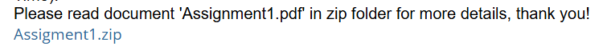

# Assignment1

本仓库包含两个主要部分（Part_1 与 Part_2）的作业实现，重点是实现基础感知机与基于 NumPy 的多层感知机 (MLP) 并完成训练/评估流程。

## 项目概述

- Part_1：实现并实验感知机（Perceptron），包含用于交互式分析的 Jupyter Notebook 和 Python 脚本。
- Part_2：实现一个基于 NumPy 的 MLP（含线性层、ReLU、SoftMax、交叉熵等模块），并提供训练脚本和实验 Notebook，用于在 make_moons 数据集上训练与可视化结果。

## 仓库结构（重要文件/目录）

Assignment1/
- Part_1/
  - Part_1.ipynb        （交互式 Notebook：感知机任务与可视化）
  - perceptron.py       （感知机脚本实现）

- Part_2/
  - Part_2.ipynb        （交互式 Notebook：任务说明、数据准备、训练与可视化）
  - mlp_numpy.py        （MLP 高层接口：模型组装、前向/反向传播）
  - modules.py          （基础模块：Linear、ReLU、SoftMax、CrossEntropy 等）
  - train_mlp_numpy.py  （命令行训练脚本：可选择优化器、学习率、隐藏层结构、batch_size 等）
  - readme.md           （Part_2 的简要说明 / 可能存在）

> 注：仓库中可能存在重复命名的文件（例如 Part_2 文件夹在仓库根与子文件夹下都可能存在副本）；请以你的工作目录（你正在编辑/运行的路径）为准。

## 主要任务说明

- Task 1 (Part_1)：实现感知机并在给定数据集上训练、可视化其分类边界与训练过程。
- Task 2 (Part_2)：实现 MLP 模型组件（线性层、激活、损失等），完成训练脚本 `train_mlp_numpy.py`，在 make_moons 数据集上跑实验并绘制训练/测试的准确率与损失曲线。

README 不包含代码实现细节；如需查看实现，请打开对应的 `.py` 或 `.ipynb` 文件。

## 运行说明（快速开始）

1) 环境准备（推荐在虚拟环境中运行）：

PowerShell 示例（Windows）：

```powershell
# 创建并激活虚拟环境（可选）
python -m venv .venv; .\.venv\Scripts\Activate.ps1

# 安装依赖
pip install --upgrade pip
pip install numpy matplotlib scikit-learn jupyter
```

2) 运行 Jupyter Notebook（交互式查看与运行）：

```powershell
jupyter notebook Part_2\Part_2.ipynb
```

3) 使用命令行训练（示例）：

在 PowerShell 中运行 `train_mlp_numpy.py`，示例参数说明：

- --optimizer: 优化器，支持 `sgd` 或 `bgd`（小批量随机梯度或批量梯度）。
- --learning_rate: 学习率（浮点数）。
- --dnn_hidden_units: 隐藏层单元，逗号分隔的字符串，例如 "128,64"。
- --batch_size: 当使用 SGD 时生效，指定小批量大小。

示例命令：

```powershell
python Part_2\train_mlp_numpy.py --optimizer sgd --learning_rate 0.005 --dnn_hidden_units "128,64" --batch_size 32
```

运行后脚本会打印训练过程中每次评估的 Loss、Train Acc、Test Acc，并在训练结束后弹出损失与准确率曲线图。

4) 运行 Part_1（感知机）Notebook 或脚本：

```powershell
jupyter notebook Part_1\Part_1.ipynb
# 或运行脚本（若实现为脚本）
python Part_1\perceptron.py
```

## 依赖（最小）

- Python 3.8+（或兼容的 Python 3 版本）
- numpy
- matplotlib
- scikit-learn
- jupyter（可选，用于 Notebook）

可通过 pip 安装上述包：

```powershell
pip install numpy matplotlib scikit-learn jupyter
```

## 注意事项与调试提示

- 数据与标签的形状/类型必须匹配：训练脚本中使用整数标签（0/1），而交叉熵实现会在内部处理 softmax 与数值稳定性。
- 如果评估准确率接近 50%，请先检查：数据分割与标签类型、SoftMax 与 CrossEntropy 的实现是否重复（即不要在模型末尾同时显式添加 SoftMax 与在损失里再次计算 softmax）。
- 如需改变训练行为（学习率、隐藏单元、batch_size、优化器），请修改运行命令的参数。

## 吐槽：assigment打错了，搞的大家的其实都没有完成assignment--因为完成的是assigment

