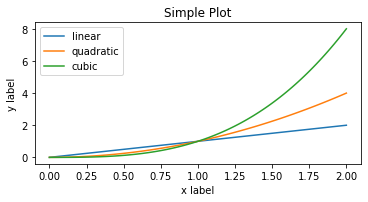
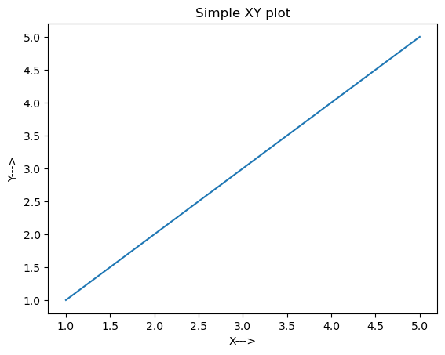
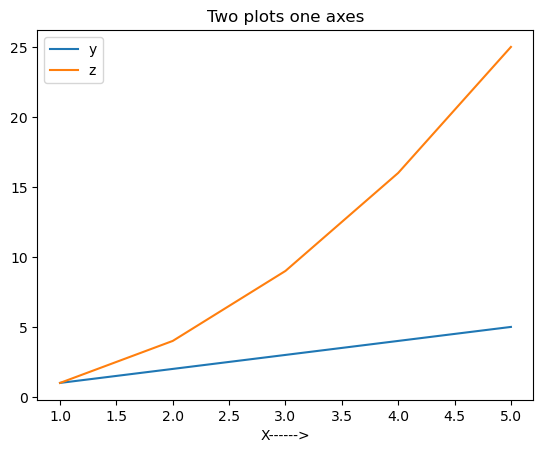
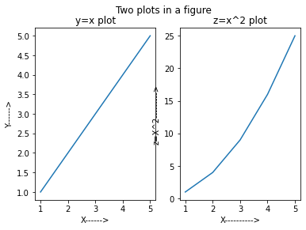
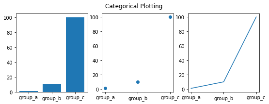
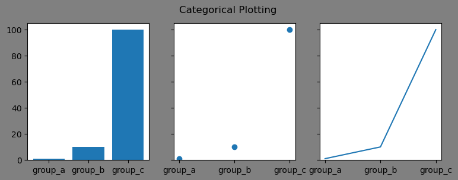
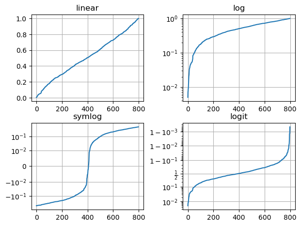

> 作者：南方的狮子先生  
> 日期：2025-09-28  
> 标签：Jupyter, Matplotlib, 图像处理, 数据可视化, Python


## 1. 运行环境

| 依赖          | 版本   | 安装命令                      |
|---------------|--------|-------------------------------|
| Python        | ≥3.9   | 自带                          |
| JupyterLab    | ≥3.5   | `pip install jupyterlab`      |
| Matplotlib    | ≥3.6   | `pip install -U matplotlib`   |
| numpy         | ≥1.23  | `pip install -U numpy`        |
| fonttools     | ≥4.33  | `pip install fonttools`       |  <!-- 用于嵌入中文字体 -->

---

## 2. Notebook 逐段讲解

> 下文代码块可直接复制进新的 Notebook 单元运行。


```python
# 0. 让 Matplotlib 在 Jupyter 里实时显示
%matplotlib inline

# 1. 解决中文乱码（Windows/Mac/Linux 通用）
from matplotlib import font_manager
font_path = 'SimHei.ttf'                # 本地黑体路径
font_manager.fontManager.addfont(font_path)
plt.rcParams['font.family'] = 'SimHei' # 全局默认字体
plt.rcParams['axes.unicode_minus'] = False  # 负号正常显示
```

### 两种编码风格
*显式地创建Figures和Axes，并调用它们的方法（“面向对象（OO）风格”）。

*依赖pyplot隐式创建和管理图形和轴，并使用pyplot函数进行打印。


#### OO风格matplotlib中的图形被划分为两个不同的对象。
 -图形对象-轴对象
 
    1.一个图形对象（figure）可以包含一个或多个轴对象。一个轴代表图中的一个绘图。在本教程中，我们将直接使用轴对象进行各种绘图。
    
    2.需要一个或多个轴（axes）对象才能开始绘图。获得轴对象的方法不止一种。我们将从add_subplot（）方法开始，稍后将探索其他方法。


在 Python 的 matplotlib 中，常见的用法如下：

```python
fig, ax = plt.subplots(...)
```

- **fig** 是 `Figure`（整张大画布）  
  负责“保存”“尺寸”“多子图布局”等高层操作  
  例如：  
  ```python
  fig.savefig('demo.pdf', dpi=300)
  ```

- **ax** 是 `Axes`（真正的坐标轴区域）  
  负责“画线”“设标题”“设坐标轴范围”等具体绘图  
  例如：  
  ```python
  ax.set_xlim(0, 1)
  ax.grid(True)
  ```

**面向对象（OO）风格核心思想**：  
“画布”和“坐标轴”分离，避免 `plt.xxx` 全局状态带来的混乱。

## 代码解读

创建空白表格

```python
fig = plt.figure()
fig.suptitle("Empley figure") # figure object
ax = fig.add_subplot(1,1,1) # axes object
plt.show()
# print(type(fig))
```


### 创建子图

#### 方法一：

```python
## Example1.1 add_subplot
fig = plt.figure()

# Generate a grid of 2x2 subplots and get
# axes object for 1st location
ax1 = fig.add_subplot(2,2,1)
ax1.set_title('First Location')

# Get the axes object for subplot at 2nd 
# location
ax2 = fig.add_subplot(2,2,2)
ax2.set_title('Second Location')

# Get the axes object for subplot at 3rd 
# location
ax3 = fig.add_subplot(2,2,3)
ax3.set_xlabel('Third Location')

# Get the axes object for subplot at 4th 
# location
ax4 = fig.add_subplot(2,2,4)
ax4.set_xlabel('Fourth Location')

# Display 
plt.show()
```

---


#### 方法二：

```python
fig, arr_ax = plt.subplots(2, 2)

# Generate a grid of 2x2 subplots and get
# axes object for 1st location
arr_ax[0,0].set_title('First Location')

# Get the axes object for subplot at 2nd 
# location
arr_ax[0,1].set_title('Second Location')

# Get the axes object for subplot at 3rd 
# location
arr_ax[1,0].set_xlabel('Third Location')

# Get the axes object for subplot at 4th 
# location
arr_ax[1,1].set_xlabel('Fourth Location')

plt.show()
```

#### 画图示例：
```python
import numpy as np
import matplotlib.pyplot as plt

# ① 生成 0~2 之间 100 个点的等差数列，方便后续画平滑曲线
x = np.linspace(0, 2, 100)

# ② 一次性创建「画布 + 坐标轴」；返回 Figure 对象 和 Axes 对象
fig, ax = plt.subplots(figsize=(5, 2.7), layout='constrained')

# ③ 在 Axes 上画三条线，并给出图例标签
ax.plot(x, x,      label='linear')    # 直线
ax.plot(x, x**2,   label='quadratic') # 二次曲线
ax.plot(x, x**3,   label='cubic')     # 三次曲线

# ④ 加坐标轴标签 & 标题
ax.set_xlabel('x label')
ax.set_ylabel('y label')
ax.set_title("Simple Plot")

# ⑤ 显示图例
ax.legend()

plt.show()
```




```python
## Example2 plot
# Generate data for plots 
x = [1, 2, 3, 4, 5]
y = x

# Get an empty figure
fig1 = plt.figure()

# Get the axes instance at 1st location in 1x1 grid
ax = fig1.add_subplot(1,1,1)

# Generate the plot
ax.plot(x, y)

# Set labels for x and y axis
ax.set_xlabel('X--->')
ax.set_ylabel('Y--->')

# Set title for the plot
ax.set_title('Simple XY plot')

# Display the figure
plt.show()
```


```python
## Example3 Multiple Graphs In Same Plot
# Function to get the square of each element in the list
def list_square(a_list):
    return [element**2 for element in a_list]

# Multiple plot in same subplot window
# plot y = x and z = x^2 in the same subplot window
fig2 = plt.figure()

x = [1, 2, 3, 4, 5]
y = x
z = list_square(x)

# Get the axes instance
ax = fig2.add_subplot(1,1,1)

# Plot y vs x as well as z vs x. label will be used by ax.legend() method to generate a legend automatically
ax.plot(x, y, label='y')
ax.plot(x, z, label='z')
ax.set_xlabel("X------>")

# Generate legend
ax.legend()

# Set title
ax.set_title('Two plots one axes')

# Display
plt.show()
```



```python
## Example4: Two Plots In A Figure
# Function to get the square of each element in the list
def list_square(a_list):
    return [element**2 for element in a_list]

# Multiple subplots in same figure
fig3 = plt.figure()
x = [1, 2, 3, 4, 5]
y = x
z = list_square(x)

# Divide the figure into 1 row 2 column grid and get the
# axes object for the first column
ax1 = fig3.add_subplot(1,2,1)

# plot y = x on axes instance 1
ax1.plot(x, y)

# set x and y axis labels
ax1.set_xlabel('X------>')
ax1.set_ylabel('Y------>')
ax1.set_title('y=x plot')

# Get second axes instance in the second column of the 1x2 grid
ax2 = fig3.add_subplot(1,2,2)

# plot z = x^2
ax2.plot(x, z)
ax2.set_xlabel('X---------->')
ax2.set_ylabel('z=X^2--------->')
ax2.set_title('z=x^2 plot')

# Generate the title for the Figure. Note that this is different then the title for individual plots
plt.suptitle("Two plots in a figure")
plt.show()

```



```python
## Example5: Histogram Plots
# Generate 1000 numbers from gaussian sample
mean = 10
std = 0.5
num_samples = 1000
samples = np.random.normal(mean, std, num_samples)

# Get an instance of Figure object
fig = plt.figure()
ax = fig.add_subplot(1,1,1)

# Generate histogram plot
ax.hist(samples)
ax.set_xlabel('Sample values')
ax.set_ylabel('Frequency')
ax.set_title('Histogram plot')

plt.show()
```

### 不同类型的图(作业中的高斯分布用散点图)：
```python

names = ['group_a', 'group_b', 'group_c']
values = [1, 10, 100]

plt.figure(figsize=(9, 3))# init size

plt.subplot(131)
plt.bar(names, values)
plt.subplot(132)
plt.scatter(names, values)
plt.subplot(133)
plt.plot(names, values)
plt.suptitle('Categorical Plotting')
plt.show()

```



共享坐标轴
```python
# use share axe
names = ['group_a', 'group_b', 'group_c']
values = [1, 10, 100]

# init size,set sharey enable,
fig,[ax0,ax1,ax2]=plt.subplots(1,3,sharey=True,facecolor='grey',figsize=(9, 3))

ax0.bar(names, values)
ax1.scatter(names, values)
ax2.plot(names, values)
plt.suptitle('Categorical Plotting')
plt.show()
```

---

### 对数轴和一些非线性轴
`matplotlib.pyplot不仅支持线性轴标度，还支持对数和logit标度。如果数据跨越多个数量级，则通常使用此方法

```python
# Fixing random state for reproducibility
np.random.seed(19680801)

# make up some data in the open interval (0, 1)
y = np.random.normal(loc=0.5, scale=0.4, size=1000)
y = y[(y > 0) & (y < 1)]
y.sort()
x = np.arange(len(y))

# plot with various axes scales
plt.figure()

# linear
plt.subplot(221)
plt.plot(x, y)
plt.yscale('linear')
plt.title('linear')
plt.grid(True)

# log
plt.subplot(222)
plt.plot(x, y)
plt.yscale('log')
plt.title('log')
plt.grid(True)

# symmetric log
plt.subplot(223)
plt.plot(x, y - y.mean())
plt.yscale('symlog', linthresh=0.01)
plt.title('symlog')
plt.grid(True)

# logit
plt.subplot(224)
plt.plot(x, y)
plt.yscale('logit')
plt.title('logit')
plt.grid(True)
# Adjust the subplot layout, because the logit one may take more space
# than usual, due to y-tick labels like "1 - 10^{-3}"
plt.subplots_adjust(top=0.92, bottom=0.08, left=0.10, right=0.95, hspace=0.25,
                    wspace=0.35)

plt.show()
```


