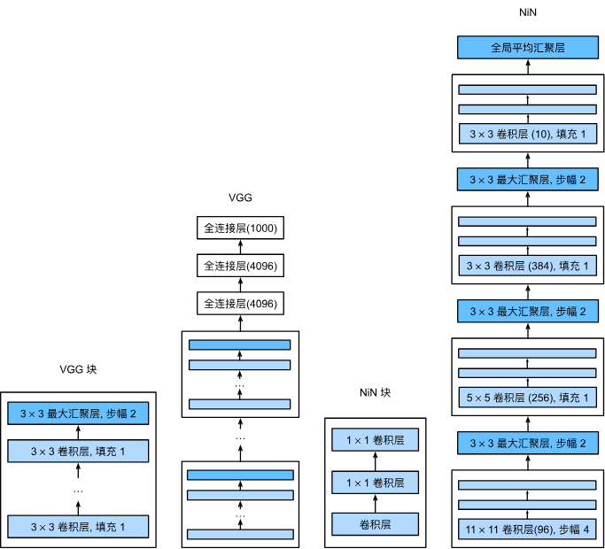

# Convolutional Neural Networks (continued)

## Document scope and language
This document continues the discussion of convolutional neural networks (CNNs). All sections are presented in English for clarity and consistency with standard academic practice.

## 1. Introduction
This lecture covers representative modern convolutional neural network architectures. The sections include:
- AlexNet
- VGGNet
- Network in Network (NiN)
- GoogLeNet

## 2. Part 1 — AlexNet
### 2.1 AlexNet: overview
AlexNet is a convolutional neural network architecture that won the ImageNet Large-Scale Visual Recognition Challenge (ILSVRC) in 2012. It was developed by Alex Krizhevsky, Ilya Sutskever, and Geoffrey Hinton. The model comprises eight learned layers: five convolutional layers and three fully connected layers, with pooling and local response normalization applied in between.

The improvements introduced by AlexNet over earlier models such as LeNet-5 include increased depth and parameter count, use of the ReLU activation function, dropout regularization to mitigate overfitting, and training on GPUs to accelerate optimization. Figure: comparison between AlexNet and LeNet-5. 

Key differences between AlexNet and LeNet-5:
- AlexNet has substantially more layers and parameters than LeNet-5.
- AlexNet uses the ReLU activation in place of sigmoid or tanh activations.
- AlexNet employs dropout in fully connected layers to reduce overfitting.
- AlexNet leverages GPU acceleration for efficient training on large datasets.

### 2.2 AlexNet: reference implementation
```python 
X = torch.randn(1, 1, 224, 224) # input_size 224*224*1
net = nn.Sequential(
    # 这里使用一个11*11的更大窗口来捕捉对象。
    # 同时，步幅为4，以减少输出的高度和宽度。
    # 另外，输出通道的数目远大于LeNet
    nn.Conv2d(1, 96, kernel_size=11, stride=4, padding=1), # cal:(224-11+2*1+4)/4=54 floor (填充之后本来公式中要加的1没了至少再步幅计算的时候是这样的，但是padding的计算又有1)（或者（224-11+2*1）/4+1=54）（两个公式都记忆，相互验证，第二个公式准确一点）
    nn.ReLU(),
    nn.MaxPool2d(kernel_size=3, stride=2), #（54-3）/2+1 = 26
    nn.Conv2d(96, 256, kernel_size=5, padding=2),#（26-5+4）/1+1 = 26
    nn.ReLU(),
    nn.MaxPool2d(kernel_size=3, stride=2),# （26-3）/2+1 = 12
    # 使用三个连续的卷积层和较小的卷积窗口。
    # 除了最后的卷积层，输出通道的数量进一步增加。
    # 在前两个卷积层之后，汇聚层不用于减少输入的高度和宽度
    nn.Conv2d(256, 384, kernel_size=3, padding=1), nn.ReLU(),
    nn.Conv2d(384, 384, kernel_size=3, padding=1), nn.ReLU(),
    nn.Conv2d(384, 256, kernel_size=3, padding=1), nn.ReLU(),
    nn.MaxPool2d(kernel_size=3, stride=2),
    nn.Flatten(),
    # 这里，全连接层的输出数量是LeNet中的好几倍。使用dropout层来减轻过拟合
    nn.Linear(6400, 4096), nn.ReLU(),
    nn.Dropout(p=0.5),
    nn.Linear(4096, 4096), nn.ReLU(),
    nn.Dropout(p=0.5),
    # 最后是输出层。由于这里使用Fashion-MNIST，所以用类别数为10，而非论文中的1000
    nn.Linear(4096, 10))
```
### 2.3 Summary：
- nn.conv2d() nn.ReLu() nn.MaxPool2d() *2
- nn.conv2d() nn.ReLu() *3
- nn.Flatten()
- nn.Linear() nn.ReLu() nn.Dropout() *2

## Part 2 — VGGNet (Visual Geometry Group)
### 2.1 VGGNet: overview
VGGNet is a family of convolutional neural networks introduced by the Visual Geometry Group at the University of Oxford; it achieved strong performance in the 2014 ImageNet Large-Scale Visual Recognition Challenge. Typical VGG variants have 16 or 19 weight layers. The architecture uses small (3×3) convolutional filters stacked sequentially, interleaved with pooling layers, and concludes with three fully connected layers.

Figure: transition from AlexNet to VGGNet. 

The canonical VGG architecture is organized into five convolutional blocks. The first two blocks contain a single convolutional layer each, while the remaining three blocks contain two convolutional layers each; each block is followed by a spatial pooling layer.

### 2.2 VGGNet: reference implementation
```python:
def vgg_block(num_convs, in_channels, out_channels):
    layers = []
    for _ in range(num_convs):
        layers.append(nn.Conv2d(in_channels, out_channels,
                                kernel_size=3, padding=1))
        layers.append(nn.ReLU())
        in_channels = out_channels
    layers.append(nn.MaxPool2d(kernel_size=2,stride=2))
    return nn.Sequential(*layers)
    # 自定义数量的卷积层+最后一个池化层
```
Net design：
```python :
conv_arch = ((1, 64), (1, 128), (2, 256), (2, 512), (2, 512))
def vgg(conv_arch):
    conv_blks = []
    in_channels = 1
    # 卷积层部分
    for (num_convs, out_channels) in conv_arch:
        conv_blks.append(vgg_block(num_convs, in_channels, out_channels))
        in_channels = out_channels

    return nn.Sequential(
        *conv_blks, nn.Flatten(),
        # 全连接层部分
        nn.Linear(out_channels * 7 * 7, 4096), nn.ReLU(), nn.Dropout(0.5),
        nn.Linear(4096, 4096), nn.ReLU(), nn.Dropout(0.5),
        nn.Linear(4096, 10))

net = vgg(conv_arch)
```
### 2.3 Summary：
- VGGNet uses 16 or 19 layers, including 13 convolutional layers and 3 fully connected layers.VGG-11 has a higher computational cost than AlexNet
- VGGNet has a higher computational cost than AlexNet.
- VGGNet uses dropout regularization to prevent overfitting.


## Part 3 — Network in Network (NiN)
### 3.1 NiN: overview
Network in Network (NiN) replaces traditional fully connected classifier layers with a global average pooling layer, and it leverages 1×1 convolutions to increase local model complexity and abstraction. Compared to AlexNet, NiN reduces the reliance on large dense layers and promotes spatially localized learning. Figure: NiN architecture. 

### 3.2 NiN: reference implementation
```python:
def nin_block(num_channels, kernel_size, strides, padding): #一个NiN块由一个卷积层、两个1*1卷积层和一个最大池化层组成
    blk = nn.Sequential()
    blk.add(nn.Conv2D(num_channels, kernel_size, strides, padding,
                      activation='relu'),
            nn.Conv2D(num_channels, kernel_size=1, activation='relu'),
            nn.Conv2D(num_channels, kernel_size=1, activation='relu'))
    return blk

net = nn.Sequential(
    nin_block(1, 96, kernel_size=11, strides=4, padding=0),
    nn.MaxPool2d(3, stride=2),
    nin_block(96, 256, kernel_size=5, strides=1, padding=2),
    nn.MaxPool2d(3, stride=2),
    nin_block(256, 384, kernel_size=3, strides=1, padding=1),
    nn.MaxPool2d(3, stride=2),
    nn.Dropout(0.5),
    # 标签类别数是10
    nin_block(384, 10, kernel_size=3, strides=1, padding=1),
    nn.AdaptiveAvgPool2d((1, 1)),
    # 将四维的输出转成二维的输出，其形状为(批量大小,10)
    nn.Flatten())  
```

### 3.3 Summary
- NiN replaces the final fully connected layers with global average pooling to produce per-class scores.
- It employs 1×1 convolutional layers to increase local representational capacity.
- NiN architectures often reduce parameter count compared with models that use large fully connected layers and can be less prone to overfitting when trained appropriately.

## Part 4 — GoogLeNet
### 4.1 GoogLeNet: overview
GoogLeNet (also referred to as Inception) introduced the Inception module, which combines multiple convolutional and pooling operations in parallel and concatenates their outputs along the channel dimension. The design allows the network to capture multi-scale features while keeping computational cost manageable.

### 4.2 Inception module

The Inception module contains parallel paths: 1×1 convolution, 1×1 followed by 3×3 convolution, 1×1 followed by 5×5 convolution, and a pooling path followed by a 1×1 convolution. Outputs from these paths are concatenated along the channel axis.

#### Inception block: reference implementation
```python:
class Inception(nn.Module):
    # c1--c4是每条路径的输出通道数
    def __init__(self, in_channels, c1, c2, c3, c4, **kwargs):
        super(Inception, self).__init__(**kwargs)
        # 线路1，单1x1卷积层
        self.p1_1 = nn.Conv2d(in_channels, c1, kernel_size=1)
        # 线路2，1x1卷积层后接3x3卷积层
        self.p2_1 = nn.Conv2d(in_channels, c2[0], kernel_size=1)
        self.p2_2 = nn.Conv2d(c2[0], c2[1], kernel_size=3, padding=1)
        # 线路3，1x1卷积层后接5x5卷积层
        self.p3_1 = nn.Conv2d(in_channels, c3[0], kernel_size=1)
        self.p3_2 = nn.Conv2d(c3[0], c3[1], kernel_size=5, padding=2)
        # 线路4，3x3最大汇聚层后接1x1卷积层
        self.p4_1 = nn.MaxPool2d(kernel_size=3, stride=1, padding=1)
        self.p4_2 = nn.Conv2d(in_channels, c4, kernel_size=1)

    def forward(self, x):
        p1 = F.relu(self.p1_1(x))
        p2 = F.relu(self.p2_2(F.relu(self.p2_1(x))))
        p3 = F.relu(self.p3_2(F.relu(self.p3_1(x))))
        p4 = F.relu(self.p4_2(self.p4_1(x)))
        # 在通道维度上连结输出
        return torch.cat((p1, p2, p3, p4), dim=1)
```
#### how about torch.cat?
```python:
import torch

# 创建四个形状为 (2, 1) 的张量
p1 = torch.tensor([[1], [2]])
p2 = torch.tensor([[3], [4]])
p3 = torch.tensor([[5], [6]])
p4 = torch.tensor([[7], [8]])

print("p1 的形状:", p1.shape)
# p1 的形状: torch.Size([2, 1])
print("p2 的形状:", p2.shape)
# p2 的形状: torch.Size([2, 1])
print("p3 的形状:", p3.shape)
# p3 的形状: torch.Size([2, 1])
print("p4 的形状:", p4.shape)
# p4 的形状: torch.Size([2, 1])

# 在通道维度上连结输出
output = torch.cat((p1, p2, p3, p4), dim=1)
print("输出的形状:", output.shape)
# 输出的形状: torch.Size([2, 4])

拼接后的结果 (dim=1):
 tensor([[1, 3, 5, 7],
        [2, 4, 6, 8]])
拼接后的形状: torch.Size([2, 4])
```

#### GoogLeNet code:


```python:
class GoogleNet(nn.Module):
  def __init__(self,in_channels,classes):
    super(GoogleNet,self).__init__()
    self.model = nn.Sequential(
              nn.Conv2d(in_channels,out_channels=64,kernel_size=7,stride=2,padding=3),nn.ReLU(),
              nn.MaxPool2d(kernel_size=3,stride=2),
              nn.Conv2d(in_channels=64,out_channels=64,kernel_size=1),nn.ReLU(),
              nn.Conv2d(in_channels=64,out_channels=192,kernel_size=3,padding=1),nn.ReLU(),
              nn.MaxPool2d(kernel_size=3,stride=2),
              Inception(192,c1=64,c2=[96,128],c3=[16,32],c4=32),
              Inception(256,c1=128,c2=[128,192],c3=[32,96],c4=64),
              nn.MaxPool2d(kernel_size=3,stride=2,padding=1),
              Inception(480,c1=192,c2=[96,208],c3=[16,48],c4=64),
              Inception(512,c1=160,c2=[112,224],c3=[24,64],c4=64),
              Inception(512,c1=128,c2=[128,256],c3=[24,64],c4=64),
              Inception(512,c1=112,c2=[144,288],c3=[32,64],c4=64),
              Inception(528,c1=256,c2=[160,320],c3=[32,128],c4=128),
              nn.MaxPool2d(kernel_size=3,stride=2,padding=1),
              Inception(832,c1=256,c2=[160,320],c3=[32,128],c4=128),
              Inception(832,c1=384,c2=[192,384],c3=[48,128],c4=128),
              nn.AvgPool2d(kernel_size=7,stride=1),
              nn.Dropout(p=0.4),
              nn.Flatten(),
              nn.Linear(1024,classes),
              nn.Softmax(dim=1)
            )
  def forward(self,X:torch.tensor):
    for layer in self.model:
      X = layer(X)
      print(layer.__class__.__name__,'output shape:',X.shape)
```

## Conclusion

This document reviewed several representative convolutional neural network architectures that have influenced modern deep learning practice. We summarized the contributions of AlexNet (demonstrating deep, GPU-accelerated training and the effectiveness of ReLU and dropout), VGGNet (the value of depth with small 3x3 filters), Network in Network (the use of 1x1 convolutions and global average pooling to reduce reliance on large dense layers), and GoogLeNet/Inception (multi-path modules that capture multi-scale features efficiently).

Across these architectures, recurring design principles emerge: increasing representational capacity while controlling computational cost, using architectural modules to capture multi-scale information, and replacing large dense classifiers with more parameter-efficient alternatives when appropriate. For practical applications, the choice of architecture should balance dataset size, compute resources, and model capacity.

For further study and to follow the state of the art, readers should examine residual networks (ResNet), dense connectivity patterns (DenseNet), efficient model families (e.g., EfficientNet), and attention-based or transformer-style models, together with modern training practices such as advanced normalization, regularization, and optimization techniques.