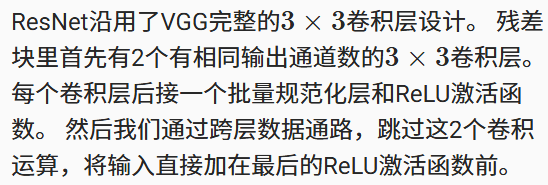

---
### **Residual Neural Networks (ResNet)**
#### **1. Introduction**
A fundamental premise in deep learning is that augmenting a model's capacity by increasing its complexity should not degrade its performance. This holds true if the space of functions representable by the deeper model encompasses the functions of the shallower one. In the context of deep neural networks, this is typically achieved by stacking layers sequentially.
However, training very deep networks presents significant challenges. The problem of **vanishing or exploding gradients**, caused by the repeated application of the chain rule during backpropagation, can impede convergence. While techniques like careful initialization and Batch Normalization mitigate this issue, another phenomenon known as **network degradation** emerges: as the network depth increases, accuracy becomes saturated and then degrades rapidly.
Residual Networks (ResNet) were introduced to address this degradation. The core idea is that it should be easier for a deeper layer to learn an **identity mapping** than to learn a new, potentially complex, function. By structuring the network to learn the *residual* (the difference between the desired output and the input), the network can, in effect, choose to bypass a layer if it provides no benefit. This ensures that even as the network deepens, it can at a minimum preserve the features of the preceding layer, preventing performance degradation.
#### **2. Architecture**
The ResNet architecture is built upon a fundamental building block called the **Residual Block**.
##### **2.1. The Residual Block**
A residual block consists of several weight layers (typically convolutions) with non-linearities, and a **skip connection** (or shortcut connection) that performs an identity mapping. The output of the block is the sum of the block's main path output and the identity-mapped input.

Let the input to a block be $X$ and the desired underlying mapping be denoted as $\mathcal{H}(X)$. Instead of learning this mapping directly, the block is reformulated to learn a residual function, defined as:
$$
\mathcal{F}(X) := \mathcal{H}(X) - X
$$
The original mapping is then recast as the sum of the input and the learned residual:
$$
\mathcal{H}(X) = \mathcal{F}(X) + X
$$
This formulation offers a significant optimization advantage. If an identity mapping is optimal (i.e., $\mathcal{H}(X) = X$), it is considerably easier for the optimizer to push the weights to make the residual function $\mathcal{F}(X)$ approach zero than it is to fit an identity mapping through a stack of non-linear layers.




The following code implements a residual block. It includes two convolutional layers, Batch Normalization, and an optional 1x1 convolution in the skip connection to handle changes in dimensions or stride.
```python
class Residual(nn.Module):  #@save
    def __init__(self, input_channels, num_channels,
                 use_1x1conv=False, strides=1):
        super().__init__()
        self.conv1 = nn.Conv2d(input_channels, num_channels,
                               kernel_size=3, padding=1, stride=strides)
        self.conv2 = nn.Conv2d(num_channels, num_channels,
                               kernel_size=3, padding=1)
        if use_1x1conv:
            self.conv3 = nn.Conv2d(input_channels, num_channels,
                                   kernel_size=1, stride=strides)
        else:
            self.conv3 = None
        self.bn1 = nn.BatchNorm2d(num_channels)
        self.bn2 = nn.BatchNorm2d(num_channels)
    def forward(self, X):
        Y = F.relu(self.bn1(self.conv1(X)))
        Y = self.bn2(self.conv2(Y))
        if self.conv3:
            X = self.conv3(X)
        Y += X
        return F.relu(Y)
```
##### **2.2. The ResNet Model**
The overall ResNet architecture starts with an initial convolution and max-pooling layer, followed by a series of stages composed of multiple residual blocks. The number of blocks in each stage increases as the spatial dimensions decrease, a common pattern in convolutional network design.

The initial layers of ResNet are similar to those in GoogLeNet, with the key distinction being the addition of a Batch Normalization layer after each convolution in ResNet.
```python
b1 = nn.Sequential(nn.Conv2d(1, 64, kernel_size=7, stride=2, padding=3),
                   nn.BatchNorm2d(64), nn.ReLU(),
                   nn.MaxPool2d(kernel_size=3, stride=2, padding=1))
def resnet_block(input_channels, num_channels, num_residuals,
                 first_block=False):
    blk = []
    for i in range(num_residuals):
        if i == 0 and not first_block:
            blk.append(Residual(input_channels, num_channels,
                                use_1x1conv=True, strides=2))
        else:
            blk.append(Residual(num_channels, num_channels))
    return blk
```
The full model is constructed by stacking these residual blocks. In the following example, each stage contains two residual blocks.
```python
b2 = nn.Sequential(*resnet_block(64, 64, 2, first_block=True))
b3 = nn.Sequential(*resnet_block(64, 128, 2))
b4 = nn.Sequential(*resnet_block(128, 256, 2))
b5 = nn.Sequential(*resnet_block(256, 512, 2))
```
#### **3. Conclusion and Impact**
While the high-level architecture of ResNet bears resemblance to GoogLeNet, its design is considerably simpler and more modular. The elegant formulation of the residual block makes the network easier to modify, adapt, and optimize. These factors, combined with its ability to train extremely deep networks effectively, have led to the rapid and widespread adoption of ResNet as a foundational architecture in computer vision and beyond.

