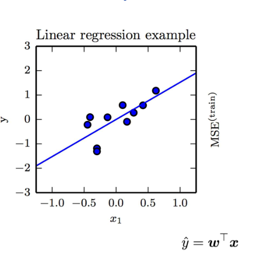
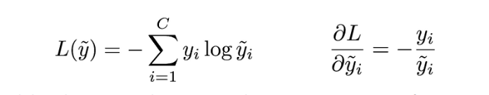
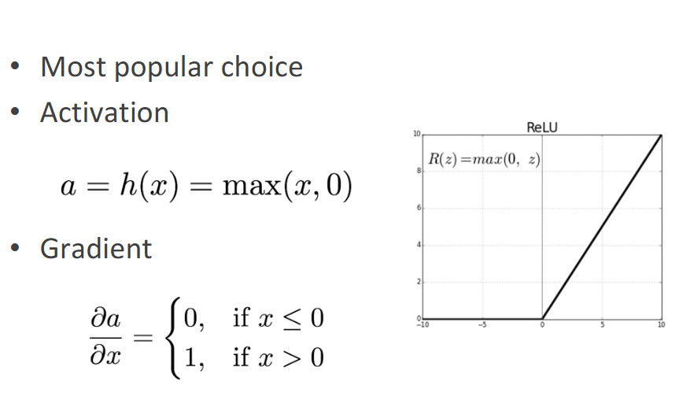
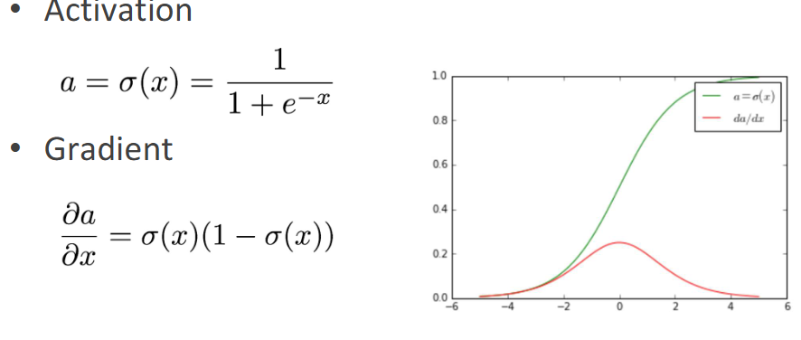
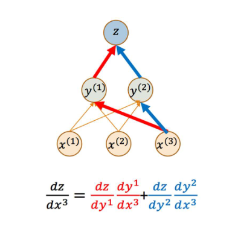

# Deep networks & backpropagation
## Learning machines
“A computer program is said to learn from
experience E with respect to some class of
tasks T and performance measure P, if its
performance at tasks in T, as measured by P,
improves with experience E.” (Mitchell, 1997)

• Task T: e.g., classification, regression, density
estimation, etc.

• Performance measure P: e.g., accuracy, error rate

• Experience E: supervised, unsupervised,
reinforcement learning
### Example: Linear regression!(线性回归)

参数介绍：

x：输入变量

y：输出变量

w：权重

b：偏置项（当然这个图里没有展示）

 Mean squared error: our performance measure

P(w,b) = 1/N ∑(y_i - (wx_i + b))^2

## error/loss 介绍：
### Training error：
 the error/loss computed on
the training set

Test error/loss: the error/loss on the test set

Generalization error/loss: the gab between
the training error and test error

Underfitting(欠拟合) and overfitting（过拟合）

Generalisation（泛化）与 Capacity（容量）
一句话先记住：
容量是模型的“智商”，泛化是它“考试”时的得分；智商太高不复习，容易作弊背答案（过拟合），考试一换题库就挂。

Capacity（容量）
抽象说法：假设空间的大小，即模型能表示的函数集合的“丰富程度”。

Generalisation（泛化）：
训练集误差 → 测试集误差的“落差”越小，泛化越好。

## Perceptron（感知机）

Going deep – Single Hidden Layer（该章节未具体介绍）

Deep neural networks（该章节未具体介绍）

Gradient-based learning：
backpropagation（反向传播）：核心想，找到最合适的权重使得我的模型的误差最小化。

Cost functions: cross entropy（交叉熵损失函数）
记忆：yi是第i个样本的真实值（0/1），yi^是第i个样本的预测值（0~1）（如果默认归一化的话）
log（yi^）是一个负数，在前面加上一个符号变为正数

## 三种output：
1. Regression: 线性输出
2. Binary classification: sigmoid输出（用于激活函数来着）
3. Multi-class classification: softmax输出（用于结果的输出）

## Hidden units（注意梯度的计算公式）: 
ReLU

sigmoid

tanh

## Architecture design
要思考的两个问题：
    1. How many layers and units?

    The more layers we have, the fewer units we
    need

    2.How many connections?

    Usually a complete set but in certain domains
    we can drop some 
    connections

## 反向传播和梯度下降：

主要的计算定理：
chain rule：

注意：z关于y的导数有的时候消不掉，要我们直接以隐函数的形式保留（高数内容）