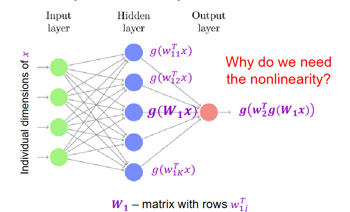
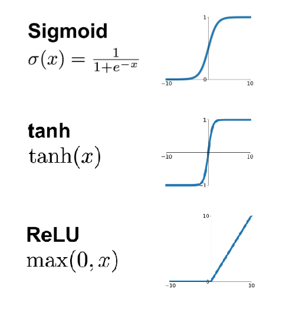
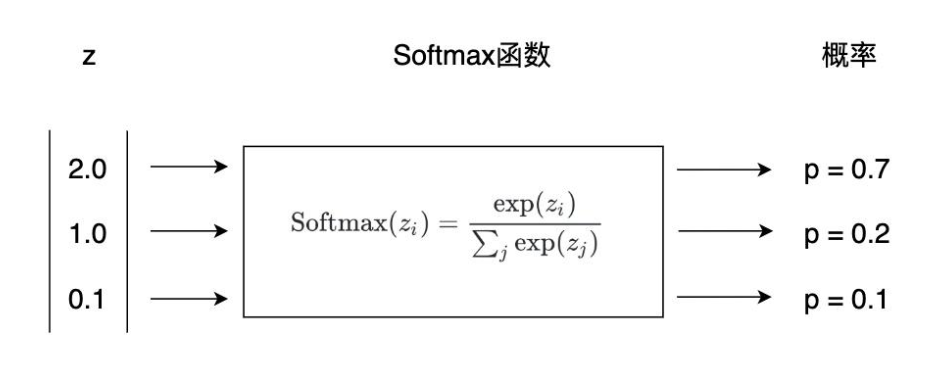

# 深度学习入门｜多层神经网络与反向传播：从加法器到梯度“快递站”

> 标签：深度学习、反向传播、链式法则、PyTorch、零基础  
> 一句总结：把“梯度”当成快递，一层一层退回去，就能把网络训练好！

---

## 一、为什么要加“隐藏层”？为什么要非线性？


上节课我们学会了两件事：

1. 把神经元当成“带旋钮的小盒子”；
2. 用梯度下降去拧旋钮，让预测误差变小。

但**单层感知机**只能画直线，遇到“异或”这种非线性问题就跪了。

### 这里给出一些例子(动手深度学习)：
#### 我们可以很容易找出违反单调性的例子。 例如，我们想要根据体温预测死亡率。 对体温高于37摄氏度的人来说，温度越高风险越大。 然而，对体温低于37摄氏度的人来说，温度越高风险就越低。 在这种情况下，我们也可以通过一些巧妙的预处理来解决问题。 例如，我们可以使用与37摄氏度的距离作为特征。

#### 但是，如何对猫和狗的图像进行分类呢？增加位置处像素的强度是否总是增加（或降低）图像描绘狗的似然？ 对线性模型的依赖对应于一个隐含的假设， 即区分猫和狗的唯一要求是评估单个像素的强度。 在一个倒置图像后依然保留类别的世界里，这种方法注定会失败。

于是，我们加了一个“隐藏层”：

- 先让输入做**线性组合**（矩阵乘法）；
- 再送进**非线性函数**（激活函数）；
- 最后再把激活结果送到输出层。


> 线性 + 非线性 ≈ 万能函数拟合器（Universal Approximator）

---

## 二、激活函数“三剑客”

| 名称 | 公式 | 形状 | 优点 | 缺点 |
| --- | --- | --- | --- | --- |
| Sigmoid | $\sigma(x)=\frac{1}{1+e^{-x}}$ | S 型 | 平滑、可导 | 两端饱和→梯度消失 |
| Tanh | $\tanh(x)$ | S 型、零均值 | 比 Sigmoid 对称 | 两端同样饱和 |
| ReLU | $\max(0,x)$ | 折线 | 计算快、不饱和 | 负半轴“神经元死亡” |

> 初学者口诀：**“隐藏层用 ReLU，最后一层看任务”**  
> 分类用 Softmax，回归用 Linear。


---

## 三、前向传播：一条“流水线”

把一张 28×28 手写数字图片拉成 784 维向量 $x$，经过：


x  ──►  h1 = ReLU(W1x + b1)      
### 第一层 256 神经元
──►  h2 = ReLU(W2h1 + b2)   
### 第二层 128 神经元
──►  ŷ = Softmax(W3h2 + b3) 
### 输出层 10 类


每一行都是“**线性变换 + 激活**”的重复，这就是**前向传播**（Forward Pass）。

---

## 四、反向传播：梯度“快递站”
计算内容：https://zhuanlan.zhihu.com/p/32819991

### 1. 核心思想

把损失 $L$ 对**每一层参数**的梯度，用**链式法则**像快递一样**从后往前**退回去。（loss往往是total loss，参数在最后会堆到一起）

### 2. 链式法则图解

以两层网络为例：

```
loss
 │
 ├─► ∂L/∂ŷ  （输出层梯度）
 │    │
 │    ├─► ∂L/∂W3  ← 直接更新 W3
 │    │
 │    └─► ∂L/∂h2  ← 继续往前“退货”
          │
          ├─► ∂L/∂W2  ← 更新 W2
          │
          └─► ∂L/∂h1  ← 再往前“退货”
               │
               └─► ∂L/∂W1  ← 更新 W1
```


> 上游快递：后一层已经算好，直接拿；  
> 本地 Jacobian：只跟本层输入/参数有关，当场算。

---

## 五、PyTorch 三行代码体验反向传播

```python
import torch

x  = torch.randn(784)
y  = torch.tensor(3)          # 真实标签

# 1. 定义网络（两层隐藏）
net = torch.nn.Sequential(
    torch.nn.Linear(784, 256),
    torch.nn.ReLU(),
    torch.nn.Linear(256, 128),
    torch.nn.ReLU(),
    torch.nn.Linear(128, 10)
)

# 2. 前向 + 损失
logits = net(x)
loss   = torch.nn.functional.cross_entropy(logits, y)

# 3. 反向传播（自动链式）
loss.backward()   # ← 梯度快递已送达
print(net[0].weight.grad.shape)  # torch.Size([256, 784])
```

`backward()` 帮我们跑完了整条“快递链”，无需手写链式法则！

---

## 六、常见“门电路”梯度规则

把网络拆成**加减乘除、激活、矩阵乘**等小零件，每个零件都有固定“退货单”：

| 门类型 | 本地梯度 | 直觉记忆 |
| --- | --- | --- |
| 加法 | 1 | 梯度**分发器**（原样往下传） |
| 乘法 | 交换伙伴 | 梯度**切换器**（乘另一个输入） |
| Max | 指示函数 | 梯度**路由器**（只给最大者） |
| Sigmoid | $\sigma(1-\sigma)$ | 自给自足，自己生自己 |

> 口诀：**“加分发，乘切换，Max 路由，Sigmoid 自乘”**

---

## 七、矩阵/向量版链式法则小贴士

1. **维度对齐**：Jacobian 形状 = (输出维, 输入维)  
   例：$z = xW,\; x\in\mathbb{R}^{1\times M},\; W\in\mathbb{R}^{M\times N}\Rightarrow\frac{\partial z}{\partial x}=W^\top$

2. **避免显式大矩阵**：  
   先写**单个元素**的偏导，再猜整体形式，可省 99% 内存。

3. **检查形状**：  
   梯度与参数形状一致，否则一定写错。

---

## 八、下节预告

第 5 讲我们将用 **ResNet 小故事** 揭开“深层”为何难训、以及**残差连接**如何拯救梯度消失！

---

如果本文帮你点亮了“反向传播”技能树，记得点赞 + 收藏 + 关注，我们下篇见！
