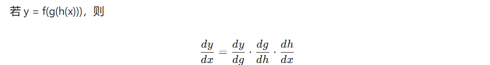
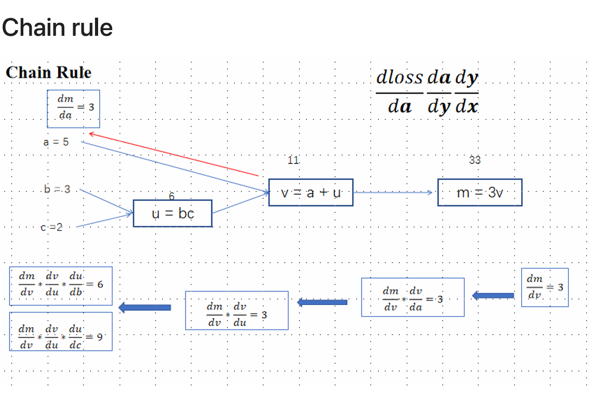
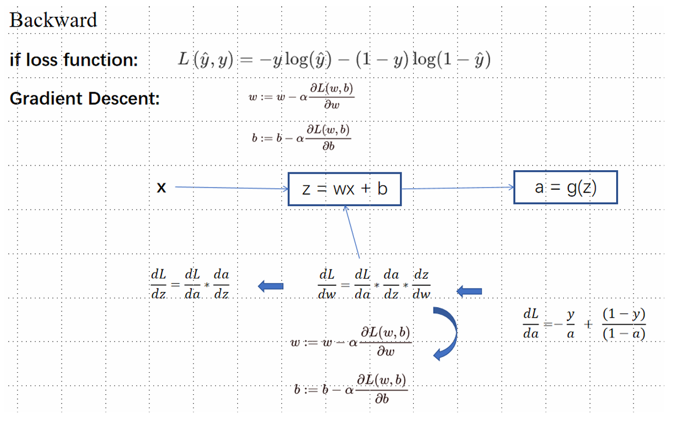
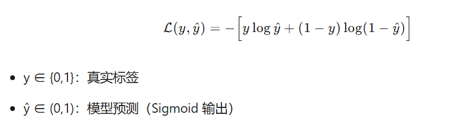

# 【深度学习】lecture4_lab补充内容：15分钟，带你从零彻底搞懂神经网络是怎么学习的！

>作者：南方的狮子先生

>日期：2025-10-10

>标签：神经网络、反向传播、链式法则、激活函数、从零实现、深度学习入门

---

### 前言

很多同学初学深度学习时，都会被“反向传播”这一术语劝退。其实，它并没有想象中那么神秘。今天，我们就用15分钟，从零开始、通俗易懂地讲清楚：

- 神经网络到底在干啥？
- 什么是链式法则？它如何支撑整个反向传播？
- 激活函数为什么必须是非线性的？
- 如何仅用NumPy，手把手搭建一个2层神经网络并训练它？

---

### 一、神经网络学习的本质：猜答案→算误差→改参数

想象你在**投篮**：

1. **前向传播**：你扔出篮球（输入数据），球进/没进（得到预测结果）。
2. **损失计算**：看球偏离篮筐多远（计算误差）。
3. **反向传播**：反思是哪个动作导致没进（计算梯度）。
4. **参数更新**：调整投篮姿势（梯度下降）。

重复以上四步，网络就“学会”了任务。

---

### 二、链式法则：把“反思”拆成每一步的“小检讨”

#### 1. 生活例子

假设：

- 汽车单价20万，购置税10%，买2辆。
- 总价 = 20 × 2 × 1.1 = 44万。

现在问：单价涨1万，最终多花多少？

把“总价”拆成3步：

| 步骤 | 中间量 | 导数（局部影响） |
|----|--------|------------------|
| ① | 单价→总价 | 2.2 |
| ② | 数量→总价 | 22 |
| ③ | 税率→总价 | 40 |

根据**链式法则**，单价对总价的导数 = 2.2。即单价每涨1万，总价涨2.2万。

#### 2. 数学表达



在神经网络里，**损失L** 是 **权重W** 的“嵌套函数”，链式法则让我们把“L对W的导数”拆成每层导数的连乘。


先写出关系公式，再求导。

---

### 三、反向传播：把误差“倒着传”回去


#### 1. 流程图（文字版）

```
┌---------┐
│  输入X   │
└----┬----┘
     │前向
┌----┴----┐
│ 隐藏层Z¹ │←------┐
└----┬----┘       │
     │激活A¹      │梯度
┌----┴----┐       │
│ 输出层Z² │←------┘
└----┬----┘
     │激活A²
┌----┴----┐
│  损失L   │
└---------┘
```

#### 2. 公式速查（不推导，直接记）

| 步骤 | 公式 | 维度说明 |
|----|------|----------|
| 输出层误差 | dZ² = A² − Y | (m,1) |
| 输出层权重梯度 | dW² = (A¹ᵀ · dZ²)/m | (hidden,1) |
| 隐藏层误差 | dZ¹ = (dZ² · W²ᵀ) ⊙ (1−A¹²) | (m,hidden) |
| 隐藏层权重梯度 | dW¹ = (Xᵀ · dZ¹)/m | (2,hidden) |

⊙ 表示逐元素乘，m为样本数。

---

### 四、激活函数：为什么必须非线性？

若不用激活函数：

\[
\begin{aligned}
A¹ &= W¹X + b¹ \
A² &= W²A¹ + b² = W²(W¹X+b¹)+b² = (W²W¹)X + (W²b¹+b²)
\end{aligned}
\]

整个网络**坍缩成单层线性模型**，无法解决XOR等非线性问题。

常用非线性激活：

| 函数 | 公式 | 优点 | 缺点 |
|----|------|------|------|
| Sigmoid | 1/(1+e⁻ˣ) | 平滑可导 | 易饱和、梯度消失 |
| Tanh | (eˣ−e⁻ˣ)/(eˣ+e⁻ˣ) | 零均值 | 同上 |
| ReLU | max(0,x) | 计算快、缓解梯度消失 | “神经元死亡” |
| Leaky ReLU | max(0.01x,x) | 解决死亡问题 | 多一个超参 |

---

### 五、从零实现神经网络
### 1.1 Import Required Packages - Generating Necessary Data
```python
import numpy as np
# Import function to generate a moons dataset
from sklearn.datasets import make_moons  
# Import function to split dataset into training and test sets
from sklearn.model_selection import train_test_split 
# Import function to calculate accuracy score
from sklearn.metrics import accuracy_score  
import matplotlib.pyplot as plt
# Generate synthetic data
# Generate a 2D dataset with 1000 samples
X, y = make_moons(n_samples=1000, noise=0.2, random_state=42)
y = y.reshape(-1, 1) 
plt.hist(y)
plt.title("The value of Label Y and its quantity")
plt.xlabel("value")
plt.ylabel("quantity")
plt.show()
# Split into training and test sets
X_train, X_test, y_train, y_test = train_test_split(X, y, test_size=0.2, random_state=42)

```

### 1.2 Initialize the Model's Parameters
① Here, we need to implement the function 
initialize_parameters() .

② We must ensure our parameters' sizes are appropriate.

③ We will initialize the weight matrix with random values.

```python
def initialize_parameters(input_dim, hidden_dim, output_dim):
    np.random.seed(42)  # Set random seed for reproducibility
    # Initialize weights for the first layer
    W1 = np.random.randn(input_dim, hidden_dim) / np.sqrt(input_dim)  
    b1 = np.zeros((1, hidden_dim))  # Initialize biases for the first layer
    # Initialize weights for the second layer
    W2 = np.random.randn(hidden_dim, output_dim) / np.sqrt(hidden_dim)  
    b2 = np.zeros((1, output_dim))  # Initialize biases for the second layer
    return {"W1": W1, "b1": b1, "W2": W2, "b2": b2}  # Return initialized parameters
```
###  1.3 Activation Functions
```python
def sigmoid(z):
    return 1 / (1 + np.exp(-z))
```
### 1.4 Forward Propagation
```python
def forward_propagation(X, parameters):
    # Unpack parameters
    W1, b1, W2, b2 = parameters["W1"], parameters["b1"], parameters["W2"], parameters["b2"]
    # Compute first layer activations
    Z1 = np.dot(X, W1) + b1
    A1 = np.tanh(Z1)
    # Compute second layer activations
    Z2 = np.dot(A1, W2) + b2
    A2 = sigmoid(Z2)
    # Cache intermediate values for use in backpropagation
    cache = {"Z1": Z1, "A1": A1, "Z2": Z2, "A2": A2}  
    # Return activation value of the output layer and cached intermediate va
    return A2, cache 
```

### 1.5 Compute Loss
```python
def compute_cost(A2, Y):
    m = Y.shape[0]  # Get number of samples
    # Compute cross-entropy loss
    logprobs = np.multiply(np.log(A2), Y) + np.multiply((1 - Y), np.log(1 - A2))
    cost = - np.sum(logprobs) / m  # Compute average loss over the dataset
    return cost  # Return cost
```

### 1.6 Backward Propagation
```python
def backward_propagation(parameters, cache, X, Y):
    m = X.shape[0]  # Get number of samples
    A1 = cache["A1"]  # Retrieve activation values of the first layer from c
    A2 = cache["A2"]  # Retrieve activation values of the second layer from 
    dZ2 = A2 - Y  # Calculate gradient at output layer
    dW2 = np.dot(A1.T, dZ2) / m  # Calculate gradient of the loss with respe
    # Calculate gradient of the loss with respect to b2
    db2 = np.sum(dZ2, axis=0, keepdims=True) / m  
    dZ1 = np.dot(dZ2, parameters["W2"].T) * (1 - np.power(A1, 2))  # Calcula
    dW1 = np.dot(X.T, dZ1) / m  # Calculate gradient of the loss with respec
    # Calculate gradient ofS the loss with respect to b1
    db1 = np.sum(dZ1, axis=0, keepdims=True) / m  
    return {"dW1": dW1, "db1": db1, "dW2": dW2, "db2": db2}  # Return gradients
```
### 1.7 Update Parameters
```python
 def update_parameters(parameters, grads, learning_rate=0.01):
    parameters["W1"] -= learning_rate * grads["dW1"]  # Update first layer w
    parameters["b1"] -= learning_rate * grads["db1"]  # Update first layer b
    parameters["W2"] -= learning_rate * grads["dW2"]  # Update second layer 
    parameters["b2"] -= learning_rate * grads["db2"]  # Update second layer 
    return parameters  # Return updated parameters
``` 
### 1.8 Batch Processing Data
```python
# Batch generator for mini-batch gradient descent
 def batch_generator(X, Y, batch_size=32):
    indices = np.arange(X.shape[0])
    np.random.shuffle(indices)
    for start_idx in range(0, X.shape[0] - batch_size + 1, batch_size):
        excerpt = indices[start_idx:start_idx + batch_size]
        yield X[excerpt], Y[excerpt]
```
### 1.9 Model Training
```python
 def model(X_train, Y_train, X_test, Y_test, n_hidden=4, n_epochs=20, batch_s
    np.random.seed(42)  # Seed random number generator
    n_input = X_train.shape[1]  # Determine input dimension
    n_output = Y_train.shape[1]  # Determine output dimension
    print(f'n_input = {n_input}, n_output = {n_output}')
    parameters = initialize_parameters(n_input, n_hidden, n_output)  # Initi
    for epoch in range(n_epochs):
        for X_batch, Y_batch in batch_generator(X_train, Y_train, batch_size
            A2, cache = forward_propagation(X_batch, parameters)  # Forward 
            cost = compute_cost(A2, Y_batch)  # Compute cost
            grads = backward_propagation(parameters, cache, X_batch, Y_batch
            parameters = update_parameters(parameters, grads)  # Update para
        
        if print_cost:
            print(f"Cost after epoch {epoch}: {cost}")
    
    return parameters  # Return learned parameters
```
### 1.10 Training the Model
```python
parameters = model(X_train, y_train, X_test, y_test, n_hidden=4, n_epochs=10
print("W1 = " + str(parameters["W1"]))
print("b1 = " + str(parameters["b1"]))
print("W2 = " + str(parameters["W2"]))
print("b2 = " + str(parameters["b2"]))
```

### 1.11 Make Predictions
```python
def predict(X_test, parameters):
    A2, _ = forward_propagation(X_test, parameters)  # Forward propagation w
    predictions = (A2 > 0.5)  # Convert probabilities to binary predictions
    accuracy = accuracy_score(y_test, predictions)  # Calculate accuracy on 
    print(f"Accuracy: {accuracy}")
    # TestingS
    # Prediction
predict(X_test, parameters)
```