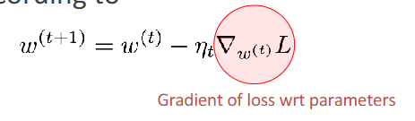

# 深度学习入门系列（四）：一文看懂反向传播（Backpropagation）

> 作者：南方的狮子先生  
> 标签：深度学习 / 反向传播 / PyTorch / 零基础 / 可视化  
> 目标：让只懂加减乘除的你也能秒懂“反向传播”！

---

## 一、为什么又有新概念？

前三节课我们学会了：

1. 把神经元当成“带旋钮（权重）的小盒子”；
2. 用“损失函数”衡量预测有多差；
3. 用“梯度下降”拧旋钮，让损失变小。

但问题是——**怎么快速算出每个旋钮该往哪边拧、拧多少？**  
如果网络有 10 层、每层 1000 个旋钮，手动算梯度岂不是要算到秃头？

于是，**反向传播（Backpropagation）** 应运而生：  
**一种用“链式法则”把梯度像快递一样层层退回的算法。**

---

## 二、快递比喻：把梯度退回给每一层

想象一条流水线：

> 原料（输入 x）→ 工人 1（层 1）→ 工人 2（层 2）→ … → 质检（损失 L）

现在质检发现：*“最后成品误差 10 分！”*  
老板希望**每个工人**都知道“自己该负多少责任”，好调整操作手册（权重 w）。

反向传播就像**写“退货单”**：

1. 先写最后一步的“责任单”：∂L/∂a^L（L 层输出对损失的影响）
2. 按相反顺序，把责任单往前传：
   - 用“链式法则”把责任拆成两部分：
     - 你本人造成的（∂a^l/∂w^l）
     - 你后面的人连累的（∂L/∂a^{l+1}）
3. 每个工人收到单据后，就知道“我该往哪边拧旋钮”（更新 w）


---
## 梯度下降算法的核心公式（记忆并背诵）



这个公式是梯度下降算法的核心公式，用于更新模型的参数 \( w \)。它是深度学习中优化模型的关键步骤之一。现在我们来详细介绍公式中的每个参数：

### 1. \( w^{(t)} \) 和 \( w^{(t+1)} \)
- \( w^{(t)} \) 表示当前的参数值（在第 \( t \) 次迭代时的权重）。
- \( w^{(t+1)} \) 表示更新后的参数值（在第 \( t+1 \) 次迭代时的权重）。

### 2. \( \eta_t \)
- \( \eta_t \) 是**学习率（Learning Rate）**，它是一个超参数，用于控制每次更新的步长大小。
  - 如果 \( \eta_t \) 太大：可能会导致训练发散（损失函数值越来越大）。
  - 如果 \( \eta_t \) 太小：训练会变得非常慢，可能需要很多次迭代才能收敛。

### 3. \( \nabla_{w^{(t)}} L \)（Gradient of loss wrt parameters）（梯度是一个向量，同时也是一个数值，相当于直接用它来表示步幅的长度，所以就没有乘一个常数了，而是用学习率来直接控制）
- 这是**损失函数 \( L \) 对参数 \( w^{(t)} \) 的梯度**，表示损失对参数的敏感程度。
  - 梯度是一个向量，方向指向损失函数增长最快的方向。
  - 在梯度下降中，我们沿着梯度的负方向更新参数，以减小损失。

### 4. \( L \)
- \( L \) 是**损失函数（Loss Function）**，用于衡量模型的预测值与真实值之间的误差。
  - 常见的损失函数包括均方误差（MSE）、交叉熵损失（Cross-Entropy Loss）等。

### 5. \( w^{(t+1)} = w^{(t)} - \eta_t \nabla_{w^{(t)}} L \)
- 这是**梯度下降的更新公式**：
  - 它表示每次迭代时，参数 \( w \) 的更新量等于**学习率 \( \eta_t \)** 和**梯度 \( \nabla_{w^{(t)}} L \)** 的乘积。
  - 更新的方向是梯度的**负方向**，因为我们希望减小损失 \( L \)。

### 公式的直观解释
- 梯度下降的目标是找到损失函数 \( L \) 的最小值。
- 每次更新参数 \( w \) 时，都朝着损失函数减小的方向（梯度的负方向）移动。
- 学习率 \( \eta_t \) 决定了每次移动的步长。

### 总结

- \( w^{(t)} \) 和 \( w^{(t+1)} \) 是模型的参数状态。
- \( \eta_t \) 控制更新的步长。
- \( \nabla_{w^{(t)}} L \) 指示损失函数的下降方向。
- \( L \) 量化了模型的误差。

### 代码实现：（动手深度学习）
```python
def sgd(params, lr, batch_size):  #@save
    """小批量随机梯度下降"""
    with torch.no_grad():
        for param in params:
            param -= lr * param.grad / batch_size(这个地方具体是怎么操作的就很明显了)
            param.grad.zero_()
```

---

## 三、数学一分钟：链式法则到底长啥样？

别怕，只看“形状”即可：

对于第 l 层，想求损失对权重 w^l 的梯度：

$$
\frac{\partial L}{\partial w^l} = \underbrace{\left( \frac{\partial a^l}{\partial w^l} \right)^T}_{\text{本地 Jacobian}} \cdot \underbrace{\frac{\partial L}{\partial a^l}}_{\text{从上层退回来的梯度}}
$$

白话：

- 左边：只跟**本层**的输出和权重有关，算一次永久保存。
- 右边：等**后一层**算完再传给你，像快递到付。

于是整个算法分三步：

| 步骤 | 方向 | 做的事 |
|---|---|---|
| ① 前向 | 从输入→输出 | 把每层输出 a^l 存起来，准备“退货”用 |
| ② 反向 | 从输出→输入 | 按上面公式把梯度一步步退回 |
| ③ 更新 | 原地 | 用退回来的梯度，按 `w = w – lr * 梯度` 拧旋钮 |

---

## 四、动画图解：一张图胜过千言万语

（这里放不了动图，推荐两个在线玩具，打开就能玩）

1. [TensorFlow Playground](https://playground.tensorflow.org)  
   把“Decision boundary”勾上，点播放，看黄色点被反向传播一步步推回隐藏层。
2. [Micrograd Visualizer](https://github.com/karpathy/micrograd)  
   Andrej Karpathy 手写版反向传播，50 行 Python 带可视化，适合抄代码。

---

## 五、PyTorch 实战：三行代码完成反向传播

理论看完，直接上手：

```python
import torch

# 1. 定义两个可训练参数
w = torch.tensor(2.0, requires_grad=True)  # 权重
b = torch.tensor(-1.0, requires_grad=True)  # 偏置

# 2. 前向：y = wx + b
x = torch.tensor(3.0)
y_pred = w * x + b
loss = (y_pred - 10)**2  # 假设目标值是 10

# 3. 反向：自动链式法则
loss.backward()

print(w.grad)  # tensor(6.)  ← 告诉你要减小 w
print(b.grad)  # tensor(2.)  ← 告诉你要增大 b
```

**解释**：  
`.backward()` 就是“自动写退货单”的魔法函数。  
PyTorch 在后台帮你把链式法则一路拆到最底层，无需手写。

---

## 六、常见坑 & 面试高频问答

| 问题 | 一句话答案 |
|---|---|
| 梯度消失？ | 链式乘太多小于 1 的数，梯度趋 0 → 用 ReLU、残差、BatchNorm |
| 梯度爆炸？ | 链式乘太多大于 1 的数，梯度爆表 → 梯度裁剪、权重初始化 |
| 反向传播 vs 梯度下降？ | 前者是“算梯度”，后者是“用梯度更新”；一个算法，一个策略 |
| 必须可导？ | 对，所以激活函数用 ReLU/Sigmoid，不用阶跃函数 |

---

## 七、总结口诀（背下来就能装大佬）

> “前向存结果，反向链式传；本地 Jacobian，乘以上层梯；一步降学习，万卷梯度平。”

---

## 八、下节预告

第 5 讲我们将用 PyTorch 搭一个 **3 层 MLP**，在 **MNIST 手写数字** 上跑一遍完整训练循环：  
DataLoader → Model → Loss → Optimizer → 训练/验证/测试  
**把今天学的反向传播真正用起来！**

---

如果本文对你有帮助，记得点赞 + 收藏 + 关注，评论区打卡“我懂反向传播了！”  