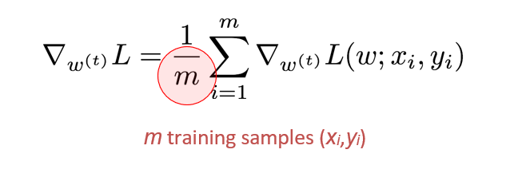
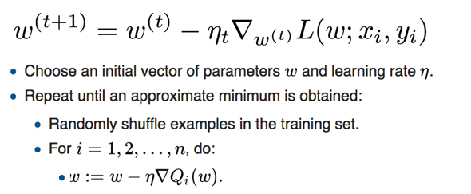
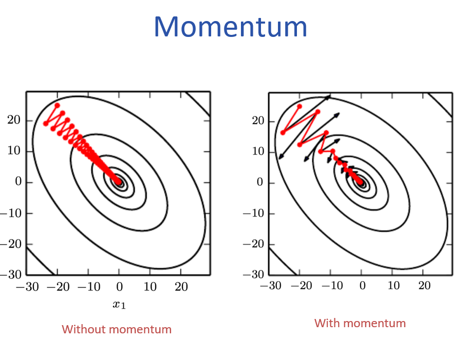
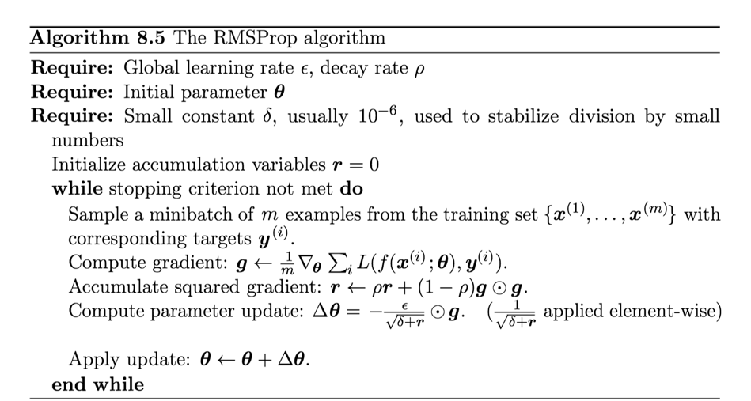

# 深度学习核心：优化与正则化超详细笔记（附图解）
> 本笔记基于南方科技大学张建国教授的《Deep Learning (CS324)》课程第五讲内容，该课程主要参考Ian Goodfellow等人的《Deep Learning Book》第7、8章。本文旨在为初学者提供一份关于深度学习优化与正则化的全面、易懂的学习指南。
## 前言：为什么优化与正则化如此重要？
想象一下，训练一个深度学习模型就像是在一个巨大、黑暗且地形复杂的山谷里寻找最低点（即损失函数的最小值）。
*   **优化** 就像是你的 **寻路策略**。你是选择一步看一步（随机梯度下降），还是先观察整个山谷的地形再行动（批量梯度下降）？你是直来直去，还是借助惯性（动量）更快地滑行？
*   **正则化** 则像是给你的 **寻路装备增加约束**。为了防止你只在训练走过的小路上表现优异（过拟合），你需要一些方法让自己变得更“皮实”，能适应各种未知的路况（泛化能力）。
掌握好这两者，是训练出高性能深度学习模型的关键。
---
## 一、梯度下降的三兄弟：批量、随机与小批量
梯度下降是优化算法的基石，但它并非只有一种形式。根据每次更新参数时使用的数据量不同，可以分为三种主要类型。
### 1.1 批量梯度下降(Batch Gradient Descent)

**核心思想**：每次更新参数时，都使用**整个训练集**来计算损失和梯度。
**计算过程**：
1.  将所有 `m` 个训练样本 `(x_i, y_i)` 输入网络。
2.  计算所有样本的平均损失 `J(θ)`。
3.  计算这个总损失关于模型参数 `θ` 的梯度 `∇J(θ)`。
4.  用这个梯度更新所有参数：`θ = θ - η * ∇J(θ)`。
**优点**：
*   **收敛路径稳定**：由于每次都考虑了所有数据，梯度方向准确，下降路径平稳，不会剧烈震荡。
*   **理论保证**：对于凸函数，保证能找到全局最优解。
**缺点**：
*   **计算成本极高**：当数据集非常大时（百万、千万级别），计算一次完整梯度需要耗费大量时间和内存，可能不切实际。
*   **容易陷入局部最优**：在非凸的深度学习损失面上，稳定的梯度可能会使其陷入某个局部最小值或鞍点，难以跳出。
> **生活比喻**：好比你要决定整个城市最受欢迎的餐厅。你调查了城市里**每一个人**的意见，然后才做出决定。这个决定非常准确，但耗时耗力。
### 1.2 随机梯度下降
**核心思想**：每次更新参数时，**只随机选择一个训练样本来**计算损失和梯度。
**计算过程**：
1.  从训练集中随机抽取一个样本 `(x_i, y_i)`。
2.  计算这个样本的损失 `J(θ; x_i, y_i)`。
3.  计算该样本的梯度 `∇J(θ; x_i, y_i)`。
4.  立即更新参数：`θ = θ - η * ∇J(θ; x_i, y_i)`。
5.  重复以上步骤，直到遍历完所有样本（完成一个epoch）。
**优点**：
*   **更新速度快**：每一步计算量极小，能快速开始学习。
*   **有助于跳出局部最优**：单样本的梯度带有很大的随机性（噪声），这种噪声虽然让下降路径看起来“醉汉走路”，但却能帮助模型“冲”出局部最小值和鞍点。
*   **适合在线学习**：对于数据流式到来的场景（如实时推荐），SGD可以即时更新模型。
**缺点**：
*   **收敛不稳定**：高方差导致更新过程震荡剧烈，损失函数下降曲线毛刺很多。
*   **无法充分利用并行计算**：一次只处理一个样本，无法发挥GPU等硬件的并行计算优势。
> **生活比喻**：还是决定餐厅，你这次只问了**街边随机遇到的一个人**的意见，然后就立刻更新你的“最佳餐厅”排名。你的排名变化很快，但可能很不稳定，容易受极端个例影响。

*图：SGD（左）震荡剧烈，BGD（右）路径平稳 [图源：PPT]*
### 1.3 小批量梯度下降
**核心思想**：这是BGD和SGD的折中方案，也是目前**深度学习领域的标准做法**。每次更新参数时，使用一小批（mini-batch）数据。
**计算过程**：
1.  从训练集中随机抽取一小批 `B` 个样本（`B` 通常是32, 64, 128...）。
2.  计算这批样本的平均损失 `J(θ; x_(i:i+B), y_(i:i+B))`。
3.  计算该批次的梯度 `∇J(θ; x_(i:i+B), y_(i:i+B))`。
4.  更新参数：`θ = θ - η * ∇J(θ; x_(i:i+B), y_(i:i+B))`。
**优点**：
*   **兼顾了效率和稳定性**：相比BGD，计算量大幅下降；相比SGD，每次更新都参考了多个样本，梯度方向更稳定，降低了方差。
*   **充分利用硬件并行性**：批量大小 `B` 可以很好地适配GPU内存，实现高效并行计算。
**缺点**：
*   **引入了一个新的超参数**：批量大小 `B` 的选择需要经验。太小则不稳定，太大则接近BGD且消耗内存。通常的选择是“尽可能大，只要GPU内存放得下”。
> **生活比喻**：你这次决定问**一小群人（比如一个办公室的同事）**的意见。这个决定比问一个人要稳定，比问全城人要高效，是现实中最好的策略。
---
## 二、优化路上的“拦路虎”：挑战与对策
即使有了梯度下降，训练过程也并非一帆风顺。我们会遇到各种棘手的“地形”。
### 2.1 病态条件
**问题描述**：损失函数在某些方向上非常陡峭，而在另一些方向上非常平缓，形成一个狭长的山谷。
**影响**：梯度下降会在陡峭的墙壁之间来回震荡，进展缓慢，难以沿着平缓的方向直达谷底。
**对策**：后面会讲到的**动量法**和**自适应学习率**方法能有效缓解这个问题。

### 2.2 局部最小值、鞍点与平台区
*   **局部最小值**：一个“小坑”，不是全局最低点。
*   **鞍点**：一个“马鞍”形状，在某些方向是最小值，在另一些方向是最大值。在高维空间中，鞍点比局部最小值更常见。
*   **平台区**：梯度接近于零的平坦区域，模型学习停滞。
**影响**：标准梯度下降可能会在这些区域“卡住”，因为梯度太小或为零，无法继续前进。
**对策**：**SGD的随机性**本身就是一种对策，噪声可以帮助模型“跳”出这些区域。此外，**动量法**也能凭借惯性冲过平缓区域。

### 2.3 悬崖与梯度爆炸
**问题描述**：参数空间中某些区域，损失函数会发生突变，形成一个“悬崖”。
**影响**：当梯度计算点靠近悬崖时，梯度值会变得异常巨大，导致参数更新步长过大，可能直接“飞”到参数空间的一个糟糕位置，甚至导致数值溢出（NaN）。
**对策**：**梯度裁剪**是一种常用技术，即设定一个梯度的阈值，当梯度的范数超过这个阈值时，就将其缩放到阈值大小。
---
## 三、给优化器装上“加速器”：动量法
为了克服上述挑战，特别是震荡和平台区问题，我们引入了动量法。
### 3.1 标准动量
**核心思想**：借鉴物理学中的动量概念。在更新参数时，不仅考虑当前梯度，还要保留一部分历史更新方向。
**类比**：想象一个球从山上滚下。如果它只受当前坡度（梯度）的影响，可能会在狭窄的山谷里来回震荡。但如果它有惯性（动量），它会积累之前的速度，更容易冲过震荡区域，更快地滚向谷底。
**公式**：
1.  `v_t = γ * v_{t-1} + η * ∇J(θ)`  （更新速度）
2.  `θ = θ - v_t`                    （用速度更新位置）
*   `v_t` 是当前时刻的“速度”向量。
*   `v_{t-1}` 是上一时刻的速度。
*   `γ` 是动量系数（通常取0.5, 0.9, 0.99），控制历史动量的保留程度。`γ` 越大，惯性越强。
*   `η` 是学习率。
**效果**：
*   **加速收敛**：在梯度方向一致的方向上，动量会累积，加速前进。
*   **抑制震荡**：在梯度方向反复变化的方向上，动量会相互抵消，减小震荡。

*图：无动量（左）震荡剧烈，有动量（右）能有效抑制震荡并加速 [图源：PPT]*
### 3.2 Nesterov 加速梯度
**核心思想**：标准动量的一个“ lookahead”改进版本。它在计算当前梯度之前，先根据历史动量“试探性地”向前走一步，然后在那个“未来位置”计算梯度并修正。
**公式**：
1.  `v_t = γ * v_{t-1} + η * ∇J(θ - γ * v_{t-1})` （在“未来位置”计算梯度）
2.  `θ = θ - v_t`
**优势**：Nesterov动量对未来的梯度有了一定的预判，使得更新方向更准确，收敛通常比标准动量更快、更稳定。
---
## 四、自适应学习率：每个参数都有自己的“学习节奏”
全局学习率 `η` 对所有参数一视同仁，但这往往不是最优的。有些参数需要大步快跑，有些则需要小步慢走。自适应学习率方法应运而生。
### 4.1 AdaGrad (Adaptive Gradient)
**核心思想**：为每个参数维护一个累积的历史梯度平方和。梯度越大的参数，其学习率会自动变得越小；反之亦然。
**公式**：
1.  `G_t = G_{t-1} + (∇J(θ))^2`  （累积梯度平方）
2.  `θ = θ - η / (√G_t + ε) * ∇J(θ)`  （用累积梯度缩放学习率）
*   `G_t` 是一个对角矩阵，存储了每个参数到当前时刻为止的梯度平方和。
*   `ε` 是一个很小的数（如1e-8），为了防止除以零。
**优点**：无需手动调学习率，能自动适应不同参数。
**缺点**：`G_t` 是单调递增的，导致学习率会不断衰减，最终可能变得非常小，导致模型提前停止学习。
### 4.2 RMSprop (Root Mean Square Propagation)

**核心思想**：这是对AdaGrad的改进。它不再累积所有历史梯度，而是使用一个**指数移动平均**来计算梯度的平方均值。这使得算法只关注最近一段时间的梯度情况。
**公式**：
1.  `E[g^2]_t = β * E[g^2]_{t-1} + (1-β) * (∇J(θ))^2`  （计算梯度平方的指数移动平均）
2.  `θ = θ - η / (√E[g^2]_t + ε) * ∇J(θ)`
*   `β` 是衰减率（通常取0.9），控制历史信息的保留程度。
**优点**：解决了AdaGrad学习率单调递减的问题，非常适合非凸优化，是深度学习中非常流行的算法。
### 4.3 Adam (Adaptive Moment Estimation)
**核心思想**：集大成者，可以看作是 **RMSprop + Momentum** 的结合体。它同时为每个参数维护了梯度的一阶矩（均值，类似动量）和二阶矩（方差，类似RMSprop）。
**公式**：
1.  `m_t = β1 * m_{t-1} + (1-β1) * ∇J(θ)`      （一阶矩估计，即动量）
2.  `v_t = β2 * v_{t-1} + (1-β2) * (∇J(θ))^2`  （二阶矩估计，即RMSprop）
3.  `m̂_t = m_t / (1 - β1^t)`                    （修正一阶矩的偏差）
4.  `v̂_t = v_t / (1 - β2^t)`                    （修正二阶矩的偏差）
5.  `θ = θ - η / (√v̂_t + ε) * m̂_t`             （更新参数）
*   `β1` 通常取0.9，`β2` 通常取0.999。
*   步骤3和4是为了在训练初期修正偏差，因为 `m_t` 和 `v_t` 初始化为0。
**优点**：
*   **结合了动量和RMSprop的优点**：既有惯性加速，又有自适应学习率。
*   **鲁棒性强**：对超参数的选择不那么敏感，通常使用默认值就能取得不错的效果。
*   **收敛速度快**：在大多数情况下是首选的优化算法。
> **总结与选择**：
> *   **初学者/快速原型**：直接用 **Adam**，简单有效。
> *   **追求最佳性能**：可以尝试 **SGD + Momentum**，并配合精良的学习率衰减策略，有时能获得比Adam更好的最终结果。
> *   **RMSprop** 也是一个非常可靠的选择，特别是在某些RNN任务中。
---
## 五、防止模型“死记硬背”：正则化技术
当模型过于复杂时，它可能会“记住”训练数据的所有细节和噪声，而不是学习其内在规律，这就是**过拟合**。正则化技术通过限制模型的复杂度来防止过拟合。
### 5.1 L1 与 L2 正则化
**核心思想**：在损失函数后面加上一个惩罚项，惩罚模型中过大的权重。
**L2 正则化（权重衰减, Weight Decay）**：
*   **惩罚项**：`λ * Σ w_i^2` （`λ` 是正则化强度）
*   **效果**：让模型的权重尽可能小，但不会变为0。这会使模型更平滑，倾向于使用所有输入特征，但给不重要的特征较小的权重。
*   **更新规则**：`θ = θ - η * ∇J(θ) - η * λ * θ`，可以看到，每次更新都会让权重 `θ` 乘以一个略小于1的因子 `(1 - η * λ)`，这就是“权重衰减”的由来。
**L1 正则化**：
*   **惩罚项**：`λ * Σ |w_i|`
*   **效果**：倾向于让不重要的权重**精确地变为0**。这使得模型变得**稀疏**，相当于自动进行了特征选择，只保留了最重要的特征。
*   **为什么能产生稀疏性？**：L1惩罚项的导数是常数（`λ * sign(w)`），无论权重多小，惩罚力度都一样，这会推动权重一直减小直到变成0。
| 特性 | L2 正则化 | L1 正则化 |
|---|---|---|
| **惩罚项** | `λ * Σ w²` | `λ * Σ |w|` |
| **权重效果** | 权重趋近于0（但不为0） | 权重变为0（稀疏） |
| **适用场景** | 通用，防止过拟合 | 需要特征选择，希望模型稀疏 |
### 5.2 数据增强
**核心思想**：与其限制模型，不如给它“看”更多的数据。当训练数据有限时，我们可以通过对现有数据进行各种变换，创造出“新”的数据。
**常见方法**：
*   **图像**：随机裁剪、旋转、翻转、颜色抖动、添加噪声等。
*   **文本**：同义词替换、回译（翻译成另一种语言再翻译回来）等。
**效果**：模型能学习到数据的不变性（比如，猫不管正着放还是倒着放都是猫），从而大大提升泛化能力。

*图：图像数据增强示例 [图源：PPT]*
### 5.3 早停
**核心思想**：一个非常简单但极其有效的正则化方法。在训练过程中，同时监控模型在训练集和验证集上的性能。
**实施步骤**：
1.  每个epoch结束后，计算验证集上的误差（或准确率）。
2.  只要验证集误差持续下降，就继续训练。
3.  当验证集误差连续多次不再下降，甚至开始上升时，就停止训练。
4.  保存验证集性能最好的那个时刻的模型参数。
**效果**：在模型刚刚开始过拟合（即开始“死记硬背”训练数据）的时候及时刹车，防止其走得太远。
### 5.4 Dropout
**核心思想**：一种在训练期间“随机失活”神经元的正则化技术。
**实施步骤**：
1.  在训练的每次迭代中，以概率 `p` 随机地选择一部分神经元，将其输出暂时置为0。
2.  前向传播和反向传播都只在剩下的神经元网络中进行。
3.  在测试时，**所有神经元都参与工作**，但它们的输出需要乘以 `p`（或者说，在训练时将存活神经元的输出除以 `p`），以补偿训练时被丢弃的神经元。
**效果**：
*   **集成学习的近似**：每次迭代都在训练一个不同的“子网络”，最终模型相当于大量子网络的集成，增强了鲁棒性。
*   **强制神经元学习冗余表示**：由于不知道哪个神经元会被丢弃，每个神经元都不能依赖于其他特定的神经元，必须学习到更有用的特征。
*   **有效防止过拟合**：是深度学习中最常用的正则化手段之一。

*图：Dropout示意图，每次随机丢弃一些神经元，形成不同的网络结构 [图源：PPT]*
---
## 六、训练的“起手式”：参数初始化与数据预处理
好的开始是成功的一半。正确的参数初始化和数据预处理能让训练事半功倍。
### 6.1 权重初始化
**为什么重要？**：如果所有权重都初始化为同一个值（比如0），那么同一层的所有神经元在反向传播时会接收到完全相同的梯度，从而进行完全相同的更新。这会导致“对称性”问题，使得所有神经元学到的东西都一样，网络失去了学习能力。
**原则**：需要打破对称性，让权重具有随机性，同时要控制好权重的尺度。
**常用方法**：
*   **Xavier/Glorot 初始化**：适用于 `tanh` 和 `sigmoid` 激活函数。它根据输入和输出的神经元数量来初始化权重，旨在让各层输入和输出的方差保持稳定。
    *   权重从 `[-√(6/(m+n)), √(6/(m+n))]` 的均匀分布中采样，其中 `m` 是输入单元数，`n` 是输出单元数。
*   **He 初始化**：适用于 `ReLU` 及其变体。考虑到 `ReLU` 会使一半的神经元输出为0，He初始化的方差是Xavier的两倍。
    *   权重从均值为0，方差为 `2/m` 的正态分布中采样。
### 6.2 数据预处理
**目标**：让输入数据更适合模型处理。
**常用方法**：
*   **零中心化**：对每个特征维度，减去其均值。使得数据以0为中心分布。
*   **归一化**：将数据缩放到相似的尺度。最常见的是将每个特征除以其标准差，使其变为标准正态分布（均值为0，方差为1）。
**为什么重要？**：如果不同特征的尺度差异巨大（比如一个特征是0-1，另一个是0-10000），那么梯度下降的路径会变得非常扭曲，收敛缓慢。归一化能让损失函数的等高线图更接近圆形，便于优化。
### 6.3 批量归一化
**核心思想**：这是一个革命性的技术，它将数据预处理的思想应用到了网络的每一层。
**问题**：在深度网络中，随着参数的更新，每一层输入的分布会不断发生变化，这被称为“内部协变量偏移”。这使得每一层都需要不断去适应新的输入分布，减慢了训练速度。
**解决方法**：在网络的每一层（通常是激活函数之前）都进行一次归一化。
**操作步骤**：
1.  对于一个mini-batch的数据，计算其均值 `μ_batch` 和方差 `σ²_batch`。
2.  对该批数据进行归一化：`x̂ = (x - μ_batch) / √(σ²_batch + ε)`。
3.  对归一化后的数据进行缩放和平移：`y = γ * x̂ + β`。其中 `γ` 和 `β` 是可学习的参数，让网络可以恢复出原始数据分布（如果需要的话）。
**惊人效果**：
*   **允许使用更大的学习率**：加速训练。
*   **减少对初始化的依赖**：即使初始化不那么好，BN也能帮助稳定训练。
*   **轻微的正则化效果**：由于每个batch的均值和方差是由该batch数据计算得出的，引入了噪声，有类似Dropout的效果。
*   **缓解梯度消失/爆炸问题**。
---
## 七、总结
训练一个深度学习模型，就像是一门艺术与科学的结合。我们需要：
1.  **选择一个合适的优化器**：从 **Adam** 开始，它是稳健的基线；若追求极致性能，可尝试 **SGD with Momentum** 配合学习率调度。
2.  **应用正则化**：**Dropout** 和 **L2 正则化** 是标配；**数据增强** 是提升性能的免费午餐；**早停** 是防止过拟合的保险。
3.  **做好准备工作**：使用 **Xavier** 或 **He** 初始化；对输入数据进行**零中心化和归一化**；在模型中加入 **批量归一化** 层，几乎总能带来提升。
这些技术不是孤立的，而是相辅相成的。理解它们的原理，并在实践中不断尝试和组合，是通往深度学习高手的必经之路。希望这份详细的笔记能为你打下坚实的基础！

