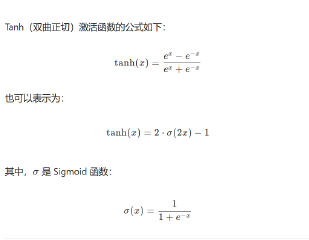
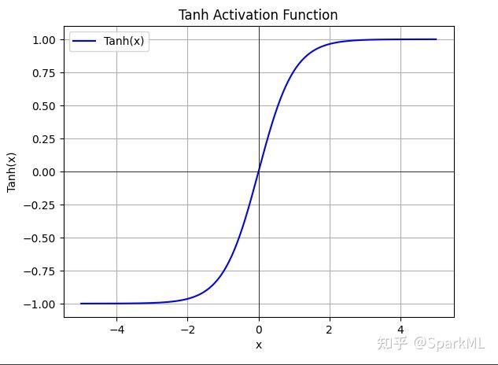
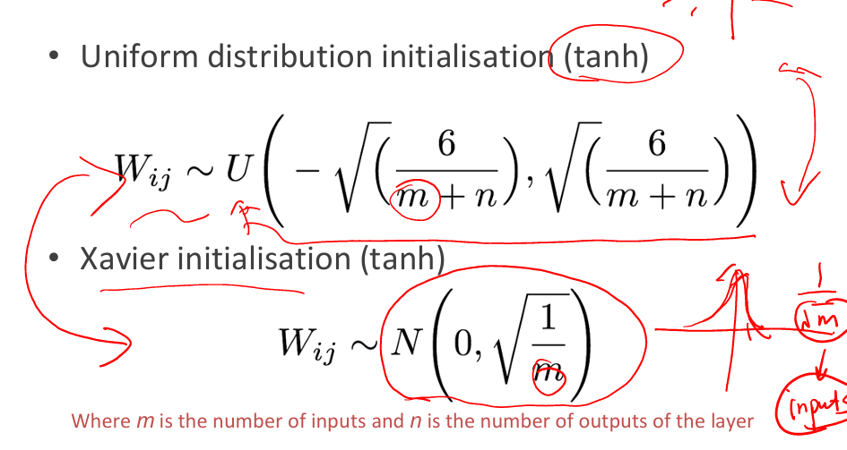
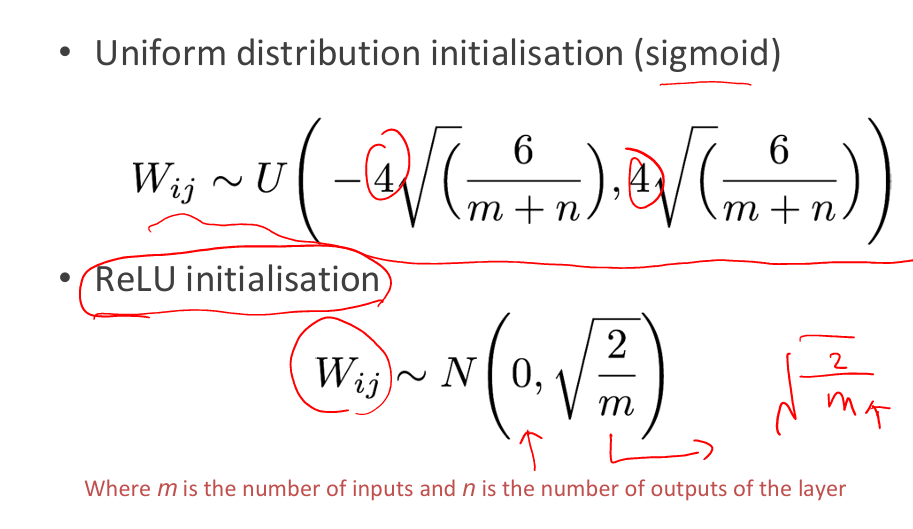

# 深度学习入门：优化与正则化（下）

> 作者：南方的狮子先生
> 日期：2025-10
> 关键词：权重初始化、数据预处理、批归一化、梯度消失、深度学习基础

---

## 1. 为啥又讲优化？——因为“起点”决定成败

上回我们聊到**梯度下降、动量、学习率、L2 正则**。  
这回把剩下 4 个“训练必踩坑”一次讲透：

| 模块 | 一句话作用 |
|---|---|
| 权重初始化 | 别让网络“天生”就对称或爆炸 |
| 输入归一化 | 把数据“拉齐”再喂网络 |
| 批归一化（BN） | 让每层输入分布稳如老狗 |
| 激活函数选择 | 别让梯度“中途猝死” |

---

## 2. 权重初始化——给网络一个“不对称”的童年（assignment 1 写之前又没讲，搞得效果比较差）

### 2.1 三大忌讳
1. 全零初始化 → 所有神经元**对称更新**，学不到东西  （weight asymmetricity）
2. 过大初始化（Large weights） → **梯度爆炸**、激活饱和（sigmoid/tanh）  
3. 过小初始化 → **信号消失**，反向传不动

### 2.2 正确姿势（如何给不同的激活函数选择正确的初始化方法）
| 激活函数 | 推荐初始化公式 | 代码片段（PyTorch） |
|---|---|---|
| tanh / softmax | Xavier 正态：$$ \mathcal{N}(0,\frac{2}{n_{in}+n_{out}}) $$ | `nn.init.xavier_normal_(m.weight)` |
| ReLU 及其变种 | Kaiming 正态：$$ \mathcal{N}(0,\frac{2}{n_{in}}) $$ | `nn.init.kaiming_normal_(m.weight, nonlinearity='relu')` |

> 记忆口诀：**“tanh 用 Xavier，ReLU 用 Kaiming”**

### 复习：
Tanh（双曲正切）激活函数的公式如下：




---

### 特点总结：

| 特性        | 描述                                                                 |
|-------------|----------------------------------------------------------------------|
| 输出范围     | (-1, 1)，**零中心化**（zero-centered）                              |
| 导数         | \(1 - \tanh^2(x)\)，在 0 附近梯度最大，两端饱和区梯度接近 0               |
| 优点         | 相比 Sigmoid，输出均值为 0，收敛更快                                  |
| 缺点         | 两端仍可能**梯度消失**（饱和区）                                      |
| 常见用途     | RNN、LSTM、GRU 中的门控信号；小型全连接网络                             |

---

### Python 代码示例（NumPy）：

```python
import numpy as np

def tanh(x):
    return np.tanh(x)  # NumPy 已内置

# 示例
x = np.array([-2, -1, 0, 1, 2])
print(tanh(x))  # 输出: [-0.96402758 -0.76159416  0.          0.76159416  0.96402758]
```


对比课件上的内容
### tanh：
- 均匀分布 （6/（m+n））
- 正态分布 （1/m）


### ReLU初始化：
- 均匀分布 4（6/（m+n））
- 正态分布 （2/m）
---

## 3. 数据预处理——把像素拉回“人间”

### 3.1 零均值 + 单位方差（Standardization）
```python
from torchvision import transforms
transform = transforms.Compose([
    transforms.ToTensor(),                      # 0~1
    transforms.Normalize(mean=[0.485, 0.456, 0.406],
                         std=[0.229, 0.224, 0.225])  # ImageNet 统计值
]) 
```

好处：
- 让**激活值**落在梯度最大区域（如 tanh 的线性区）
- 不同特征**梯度量级一致**，收敛更快

### 3.2 协方差归一化（白化，进阶）
- 把特征维度**去相关**，让椭圆等高线变圆，梯度方向更优
- 计算量大，通常只在小数据集/第一层使用

---

## 4. 批归一化（BatchNorm）——训练加速外挂（动手深度学习中提到其似乎增大了数据的噪音）

### 重要条件：  Two important principles.
-  zero-centred以零为中心
-  constant through time and data (mini-batches)时间和数据不变（小批量）
### 4.1 动机
> “Internal Covariate Shift”：前面层一更新，后面层输入分布就“漂移”，被迫不停重新适应。

### 4.2 做法（一句话）
对每个**mini-batch**的每个通道做：
1. 算均值 & 方差
2. 零均值单位方差
3. 再**缩放+平移**（可学参数 γ, β）

公式：（将每一个点处理一下）（记忆公式）
$$
\hat{x}_i = \frac{x_i - \mu_B}{\sqrt{\sigma_B^2 + \epsilon}}, \quad y_i = \gamma \hat{x}_i + \beta
$$

### 4.3 效果
- 学习率可以**放大 5×** 不炸
- 对初始权重**不再敏感**
- 轻微**正则化**效果（训练时统计量有噪声）

### 4.4 使用小贴士
- 放在**卷积/线性层之后**，**激活函数之前**（主流做法）
- 训练时 `model.train()`，推理时 `model.eval()` 会自动切换统计量
- batch_size 过小时（<8）建议改用 **GroupNorm / LayerNorm**

---

## 5. 激活函数再回顾——“死亡 ReLU”怎么破？

| 函数 | 形状 | 优点 | 缺点 | 适用 |
|---|---|---|---|---|
| Sigmoid | 两头饱和 | 概率解释 | 梯度消失 | 输出层二分类 |
| Tanh | 零中心 | 比 sigmoid 强 | 仍有饱和 | 小网络 |
| ReLU | 单侧线性 | 快、简单 | 神经元“死亡” | 大多数 CNN |
| LeakyReLU | 负坡小斜率 | 缓解死亡 | 多超参 | 自定义 |
| ELU/Swish | 平滑负区 | 精度+ | 计算+ | 竞赛刷分 |

> 默认顺序：**ReLU → LeakyReLU → Swish**（先试最简单的）

---

## 6. 一条龙训练模板（PyTorch 版）

```python
class SimpleNet(nn.Module):
    def __init__(self):
        super().__init__()
        self.fc = nn.Sequential(
            nn.Linear(784, 256),
            nn.BatchNorm1d(256),   # BN 在激活前
            nn.ReLU(inplace=True),
            nn.Linear(256, 10)
        )
        # 权重初始化
        for m in self.modules():
            if isinstance(m, nn.Linear):
                nn.init.kaiming_normal_(m.weight, nonlinearity='relu')

    def forward(self, x):
        return self.fc(x)

# 优化器 + 学习率调度
optimizer = torch.optim.AdamW(model.parameters(), lr=3e-3, weight_decay=1e-4)
scheduler = torch.optim.lr_scheduler.CosineAnnealingLR(optimizer, T_max=10)
```

---

## 7. 常见踩坑 FAQ

| 现象 | 可能原因 | 快速排查 |
|---|---|---|
| 训练 loss 不降 | 学习率太小 / 数据没归一化 | 先打印第一层激活均值方差 |
| 验证精度震荡大 | BN 统计量不准 | 把 batch_size 调到 ≥16 |
| ReLU 全零输出 | 初始权重全负 / 学习率过高 | 用 LeakyReLU 或降学习率 |
| 梯度爆炸 | 权重初始化太大 | 加 gradient clipping + Kaiming |

---

## 8. 总结脑图

```text
深度学习训练流程
├── 数据
│   └── 归一化（零均值 / 白化）
├── 模型
│   ├── 权重初始化（Xavier / Kaiming）
│   ├── 激活函数（ReLU 家族）
│   └── 批归一化（BN / GN）
├── 优化器
│   ├── 学习率 + 调度器
│   └── 正则化（L2 + BN 隐式）
└── 调参
    └── 监控梯度 / 激活分布
```

---

## 9. 下一步学什么？
- 更深的网络 → **残差结构（ResNet）**
- 更稳的 BN → **LayerNorm / Weight Standardization**
- 更猛的优化器 → **AdamW + cosine / OneCycle**

---

## 10. 一键运行 Demo

GitHub 仓库（含 notebook + 数据）  
[https://github.com/yourname/dl-optimization-101](https://github.com/yourname/dl-optimization-101)  
clone 后直接：
```bash
pip install -r requirements.txt
jupyter notebook 01_mnist_baseline.ipynb
```

---

🎉 **如果本文帮到你，记得点赞 + 收藏 + 关注，评论区一起交流踩坑史！**
```