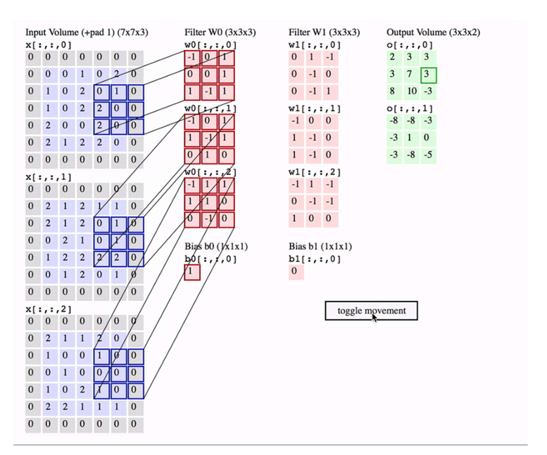
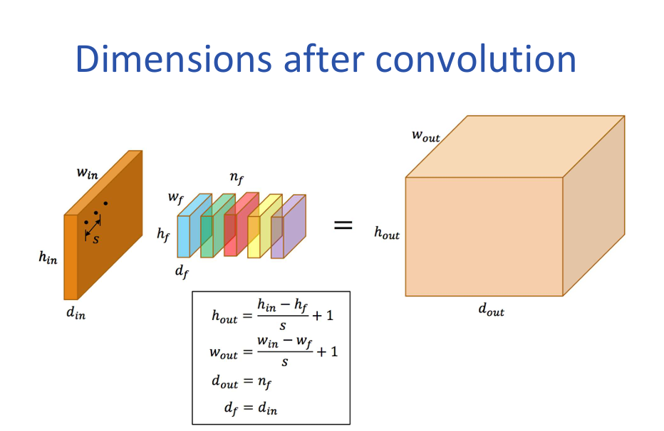

# 卷积神经网络（CNN）入门：看图识物不再难！

> 作者：南方的狮子先生

> 日期：2025-10  

> GitHub仓库地址：https://github.com/TZ-WYmail/SUSTech-CS312-DeepLearning（包含课件内容，发财小手点点star）

> 关键词：CNN、卷积、池化、参数共享、稀疏连接、图像识别、初学者

---
## 个人感觉课件内容不如动手深度学习的内容详细（课件实在是太抽象了）  
## 1. 为什么图像不适合全连接网络？（参数数量太多，直接爆炸）

想象把一张 **1920×1080 的 RGB 照片** 直接拉平：  
\[
1920 \times 1080 \times 3 = 6\,220\,800 \text{ 个像素}
\]  
再接一层 **100 个神经元** 的全连接：  
\[
6\,220\,800 \times 100 = 622\,080\,000 \text{ 个参数！}
\]  
→ **6 亿参数**，内存爆炸，还容易过拟合。  
更糟的是：把图像**右移 1 像素**，输入向量完全变了，网络又得重新学——**毫无平移鲁棒性**。

---

## 2. CNN 的核心思想（一句话记住）

> **“用滑动窗口扫描图片，同一组参数反复使用！”**

这样就把 **6 亿参数** 压到 **几万**，而且**天生不怕图像平移**。

---

## 3. CNN 四大法宝

| 法宝 | 作用 | 生活比喻 |
|---|---|---|
| **卷积** | 提取局部特征（边缘、纹理） | 放大镜逐格看 |
| **参数共享** | 同一个“放大镜”全图用 | 全世界共用一把尺子 |
| **稀疏连接** | 每个输出只依赖一小片输入 | 只问邻居，不找全小区 |
| **池化** | 下采样、降维、抗小扰动 | 把 4 张照片压成 1 张最显眼 |

---

## 4. 卷积到底在算什么？

### 4.1 二维卷积动图（文字版）
```
输入 5×5        核 3×3        输出 3×3
┌──────┐       ┌──────┐     ┌──────┐
│1 2 3│       │a b c│     │ a·1+b·2+c·3 │
│4 5 6│ *     │d e f│  =  │ +d·4+e·5+f·6 │  ← 把 9 个乘加结果写进一个格子
│7 8 9│       │g h i│     │ = 单点输出    │
└──────┘       └──────┘     └─────────────┘
```
→ 核（kernel）像“**特征探测器**”，滑完整张图就得到一张**特征图**（feature map）。


### 公式：

S：stride （步幅）
H_out（高度方向上面的（shape【0】））=(H_in-K+P)/S+1 或者 floor((H_in-K+P+S)/S)


### 4.2 代码一行的样子
```python
import torch.nn as nn
conv = nn.Conv2d(in_channels=3, out_channels=16, kernel_size=3, stride=1, padding=1)
```

---

## 5. 池化：把“不重要”的信息扔掉

| 类型 | 做法 | 效果 |
|---|---|---|
| **Max Pooling** | 取 2×2 窗口里最大值 | 保留最显著特征，抗微小位移 |
| **Average Pooling** | 取 2×2 窗口平均值 | 平滑降噪，但不如 Max 常用 |

```python
pool = nn.MaxPool2d(kernel_size=2, stride=2)  # 宽高各减半
```

---

## 6. 零填充（Padding）——控制输出尺寸

- **Valid padding**：不补 0，输出越来越小。  
- **Same padding**：补 0，输出**与输入同尺寸**（方便堆叠）。

公式（不含 padding）：
\[
H_{\text{out}} = \left\lfloor \frac{H_{\text{in}} - H_{\text{kernel}}}{\text{stride}} \right\rfloor + 1
\]
想保持尺寸？把 padding 设为：
\[
\text{padding} = \left\lfloor \frac{\text{kernel\_size}}{2} \right\rfloor
\]

---

## 7. 参数共享 vs 局部连接

| 模式 | 参数量 | 说明 |
|---|---|---|
| **全连接** | $H \times W \times C \times N$ | 每个输出神经元连所有输入，参数爆炸 |
| **局部连接** | 降维但仍**位置专用参数** | 核不一样，参数量仍大 |
| **卷积（参数共享）** | **核大小×输入通道×输出通道** | 同一核全图滑，参数暴降 |

---

## 8. 真实滤镜长啥样？

这是 ImageNet 上**学到的 96 个 11×11 彩色滤镜**（Krizhevsky 等）：

```
RGB 11×11 → 边缘、颜色 blob、纹理
```
→ 网络自己学会**边缘检测**（类似 Sobel）、**颜色斑点**，无需手工设计！

---

## 9. 完整 CNN 玩具例子（PyTorch）

```python
import torch.nn as nn

class TinyCNN(nn.Module):
    def __init__(self):
        super().__init__()
        self.features = nn.Sequential(
            nn.Conv2d(3, 16, 3, padding=1),  # 32×32×3 → 32×32×16
            nn.ReLU(),
            nn.MaxPool2d(2),                 # 32×32×16 → 16×16×16

            nn.Conv2d(16, 32, 3, padding=1), # 16×16×16 → 16×16×32
            nn.ReLU(),
            nn.MaxPool2d(2)                  # 16×16×32 → 8×8×32
        )
        self.classifier = nn.Sequential(
            nn.Flatten(),                    # 8×8×32 = 2048
            nn.Linear(2048, 10)              # 10 分类
        )

    def forward(self, x):
        x = self.features(x)
        return self.classifier(x)
```

---

## 10. 常见坑 & 小贴士

| 现象 | 可能原因 | 快速修 |
|---|---|---|
| 输出尺寸太小 | 没 padding / 池化太多 | 加 padding 或减 stride |
| 参数还是多 | 卷积核太大 | 把 5×5 拆成两个 3×3（相同感受野，参数↓） |
| 过拟合 | 模型太大 | 加 Dropout、数据增强、减小通道数 |

---

## 11. 总结脑图（文字版）

```
图像输入
   │
   ├─→ 卷积层：滑窗提取特征（参数共享）
   ├─→ 激活层：ReLU 等非线性
   ├─→ 池化层：下采样、抗平移
   ├─→ 重复 N 次（越往后通道越多、尺寸越小）
   │
   ├─→ 展平 → 全连接 → Softmax
   │
   ↓
类别概率
```

---

## 12. 下一步学什么？

- **经典架构**：LeNet → AlexNet → VGG → ResNet（下周详解）
- **进阶技巧**：1×1 卷积、残差连接、分组卷积、空洞卷积
- **实战项目**：用 CNN 做 **CIFAR-10 分类** 或 **Kaggle 猫狗大战**

---

🎉 **如果本文帮你扫盲成功，记得点赞 + 收藏 + 关注！**  
评论区留下你的 **CNN 第一步** 踩坑史，一起交流 ~
```